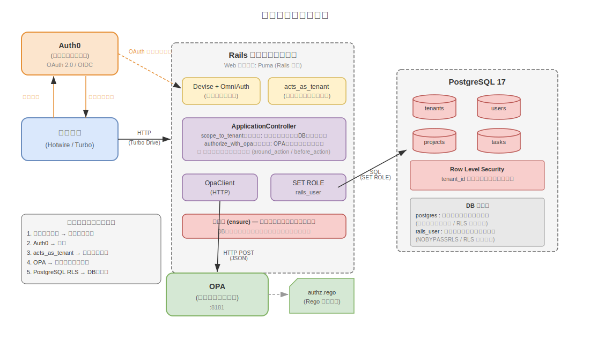

> 🇺🇸 [English version here](README.md)

# マルチテナント タスク管理アプリ (Rails, Hotwire, RLS, OPA, Auth0)

Ruby on Rails で構築された **B2B 向けプロジェクト・タスク管理 MVP** です。  
マルチテナントのデータ分離、OPA によるポリシーベースの認可、Hotwire を活用したモダンな UI を紹介する**技術デモプロジェクト**です。

機能は意図的に最小限に抑えていますが、**アーキテクチャ、セキュリティ、説明可能性**に重点を置いており、学習・実験・ポートフォリオ用途に適しています。


## 主な特徴

- **多層テナント分離**  
  アプリケーション層で Gemライブラリ `acts_as_tenant` によるテナント分離と、データベース層での **PostgreSQL Row Level Security (RLS)** による二重保護。

- **ポリシーベースの認可**  
  ロールベースのアクセス制御を **Open Policy Agent (OPA)** に外部化し、コントローラから認可ルールを分離。

- **SPA ライクなユーザー体験**  
  Hotwire (Turbo Drive / Turbo Frames) により、フルページリロードなしのシームレスな UI 更新を実現。

- **Auth0 認証**  
  認証を Auth0 (Devise + OmniAuth) に委譲。  
  Auth0 は本人確認のみを担当し、ロール管理は Rails 内で完結。


## 技術スタック

| カテゴリ       | 技術                                                  |
| -------------- | ----------------------------------------------------- |
| バックエンド   | Ruby 3.4 / Rails 8.1                                  |
| データベース   | PostgreSQL 17 (RLS 有効)                               |
| フロントエンド | Hotwire (Turbo Drive / Turbo Frames)                  |
| 認証           | Devise + omniauth-auth0                               |
| 認可           | Open Policy Agent (OPA)                               |
| マルチテナンシー | acts_as_tenant                                      |
| テスト         | RSpec, FactoryBot, shoulda-matchers, WebMock          |
| 開発環境       | DevContainer (Docker Compose)                         |
| CI             | GitHub Actions (RSpec / OPA ポリシーテスト / Brakeman / RuboCop / Importmap audit) |


## アーキテクチャ概要



ブラウザからのリクエストは、Rails アプリケーション（Web サーバーには Rails 標準の [Puma](https://puma.io/) を使用）で処理されます。  
認証は外部サービス Auth0 に委譲し、認可判定は OPA（ポリシーエンジン）に問い合わせます。  
データベースには PostgreSQL の Row Level Security (RLS) を有効化し、テナント間のデータ分離をデータベースレベルで強制しています。


## セキュリティレイヤー

| レイヤー | 実装 |
| --- | --- |
| テナント識別 | サブドメインでテナントを分離（例: `company-a.localhost`, `company-b.localhost` のように、サブドメイン部分でテナントを識別） |
| 認証 | Auth0 に認証を委譲し、DeviseでRails側のセッション管理を実施 |
| アプリケーション層でのテナント分離 | マルチテナント用 gemライブラリ [acts_as_tenant](https://github.com/ErwinM/acts_as_tenant) により、ActiveRecord のクエリに自動でテナント条件を付加 |
| ロールベースの認可 | 外部ポリシーエンジン [OPA](https://www.openpolicyagent.org/) にアクセス制御ルールを定義（admin / member / guest の 3 ロール） |
| DB層でのテナント分離 | PostgreSQLのRLS機能にて、データベースレベルで他テナントの行レベルでのアクセスを遮断 |

> 詳細なドキュメントは [docs/](docs/README.ja.md) ディレクトリを参照してください。


## 画面 / ルーティング

| 画面           | パス                      | 説明                                 |
| -------------- | ------------------------- | ------------------------------------ |
| プロジェクト一覧 | `/projects`             | テナント内の全プロジェクトを一覧表示（admin/memberはCRUD可） |
| タスク一覧     | `/projects/:id/tasks`     | インラインステータス更新付きタスク一覧（admin/memberはCRUD可） |
| タスク詳細     | `/projects/:id/tasks/:id` | タスク詳細・編集・ステータス更新     |
| ユーザー管理   | `/admin/users`            | ユーザー一覧とロール管理             |
| テナント設定   | `/settings`               | テナント名の表示・編集（adminのみ）  |


## セットアップ

### 前提条件

- [Docker](https://www.docker.com/) および [Docker Compose](https://docs.docker.com/compose/)
- [Visual Studio Code](https://code.visualstudio.com/) と
  [Dev Containers 拡張機能](https://marketplace.visualstudio.com/items?itemName=ms-vscode-remote.remote-containers) (推奨)


### 1. リポジトリのクローン

```bash
git clone <repository-url>
cd rails_hotwire_opa_tenant_manager
```


### 2. Dev Container の起動

VS Code でプロジェクトを開き、**Reopen in Container** を選択します。

以下のサービスが起動します：

| サービス | ポート | 用途              |
| -------- | ------ | ----------------- |
| app      | 8080   | Rails アプリケーション |
| db       | 5432   | PostgreSQL        |
| opa      | 8181   | OPA ポリシーエンジン |

> `bundle install` はコンテナ作成時に自動実行されます（`devcontainer.json` の `postCreateCommand`）。手動での gem インストールは不要です。


### 3. データベースセットアップ

Dev Container 内で：

```bash
bin/rails db:create
bin/rails db:migrate
bin/rails db:seed
```


### 4. Auth0 と環境変数の設定

`.devcontainer/.env` を以下の変数で作成します：

| 変数                        | 説明                                     |
| --------------------------- | ---------------------------------------- |
| AUTH0_CLIENT_ID             | Auth0 アプリケーションのクライアント ID  |
| AUTH0_CLIENT_SECRET         | Auth0 アプリケーションのクライアントシークレット |
| AUTH0_DOMAIN                | Auth0 テナントドメイン                   |
| SEED_ADMIN_EMAIL_COMPANY_A  | Company A 初期管理者のメールアドレス     |
| SEED_ADMIN_EMAIL_COMPANY_B  | Company B 初期管理者のメールアドレス     |

シード管理者のメールアドレスは、初期管理者がログインに使用する Google アカウント（または他の Auth0 ID プロバイダー）のメールアドレスと一致する必要があります。

> Auth0 が未設定の場合、開発専用のユーザー選択画面が表示されます。


### 5. Rails サーバーの起動

```bash
bin/rails server -b 0.0.0.0 -p 8080
```


### 6. テストの実行

Dev Container 内で：

```bash
# RSpec
bundle exec rspec

# OPA ポリシーテスト
docker exec -i $(docker ps -qf "ancestor=openpolicyagent/opa:latest") opa test /policies/ -v

# Brakeman
bundle exec brakeman --no-pager

# RuboCop
bundle exec rubocop

# Importmap audit
bin/importmap audit
```

> テスト構成と設計の詳細は [docs/testing.ja.md](docs/testing.ja.md) を参照してください。

サブドメインでアプリケーションにアクセスします：

- `http://company-a.localhost:8080` — Company A テナント
- `http://company-b.localhost:8080` — Company B テナント


## Seed データ

`bin/rails db:seed` を実行すると、以下の初期データが投入されます。

| テナント  | サブドメイン | ユーザー        |
| --------- | ------------ | --------------- |
| Company A | company-a    | Admin A (admin) |
| Company B | company-b    | Admin B (admin) |

Seed で作成される管理者ユーザーは `seed_admin: true` フラグが付与され、ロールの変更はできません。  
追加ユーザーは Auth0 初回ログイン時に `guest` ロールで自動作成され、管理者がロールを変更できます。


## 学習・設計の重点

このプロジェクトでは、以下のテーマに意図的にフォーカスしています：

- **PostgreSQL RLS によるテナント分離** — データベースレベルで他テナントのデータへのアクセスを物理的に遮断
- **OPA への認可ロジックの外部化** — 認可ルールを Controller クラスから分離し、OPA の Rego ポリシーファイルに集約
- **`SET ROLE` によるコネクションプールの安全な運用** — リクエストごとに `around_action` + `ensure` ブロックで DB ロールを切り替え・復元し、コネクションプールに汚染された接続が残らない設計（ライブラリではなく自前の実装パターン）
- **Dev Container による開発環境の統一** — Docker Compose で Rails / PostgreSQL / OPA を含む開発環境を丸ごと再現可能に構成

アーキテクチャを理解しやすくするため、機能スコープは意図的に小さく保っています。


## 今後の改善予定

- OPA を使用したトークンベースの API 認可


## 免責事項

このプロジェクトは**学習・ポートフォリオ向けの技術デモ**です。

- Auth0 の本番設定は含まれていません
- セキュリティレビューなしでの本番利用は想定していません


## ライセンス

[MIT License](LICENSE)
