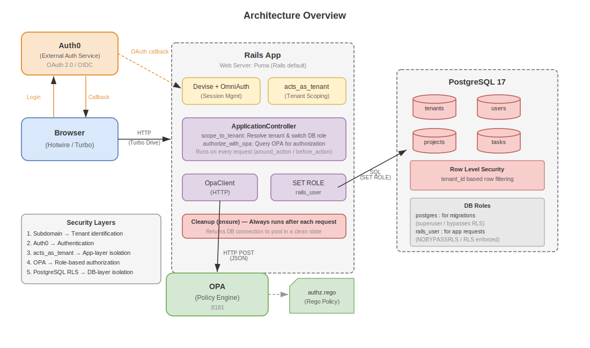

> 🇯🇵 [日本語版はこちら](README.ja.md)

# Multi-Tenant Task Management App (Rails, Hotwire, RLS, OPA, Auth0)

This repository contains a **B2B-oriented project and task management MVP** built with Ruby on Rails.  
It is a **technical demonstration project** that showcases multi-tenant data isolation, policy-based authorization with OPA, and a modern Hotwire-driven UI.

The application is intentionally minimal in features, but strong in **architecture, security, and explainability**, making it suitable for learning, experimentation, and portfolio use.


## Key Features

- **Multi-layer tenant isolation**  
  Dual protection using `acts_as_tenant` at the application layer and **PostgreSQL Row Level Security (RLS)** at the database layer.

- **Policy-based authorization**  
  Role-based access control is externalized to **Open Policy Agent (OPA)**, keeping authorization rules out of controllers.

- **SPA-like user experience**  
  Hotwire (Turbo Drive / Turbo Frames) enables seamless UI updates without full page reloads.

- **Auth0 authentication**  
  Authentication is delegated to Auth0 (Devise + OmniAuth).  
  Auth0 handles identity verification only; role management is handled entirely within Rails.


## Technology Stack

| Category       | Technology                                            |
| -- | -- |
| Backend        | Ruby 3.4 / Rails 8.1                                  |
| Database       | PostgreSQL 17 (RLS enabled)                           |
| Frontend       | Hotwire (Turbo Drive / Turbo Frames)                  |
| Authentication | Devise + omniauth-auth0                               |
| Authorization  | Open Policy Agent (OPA)                               |
| Multi-tenancy  | acts_as_tenant                                        |
| Testing        | RSpec, FactoryBot, shoulda-matchers, WebMock          |
| Environment    | DevContainer (Docker Compose)                         |
| CI             | GitHub Actions (RSpec / OPA policy test / Brakeman / RuboCop / Importmap audit) |


## Architecture Overview



Incoming requests are handled by the Rails application (using [Puma](https://puma.io/), the default Rails web server).  
Authentication is delegated to Auth0 (an external identity service), and authorization decisions are made by querying OPA (a policy engine).  
PostgreSQL Row Level Security (RLS) enforces tenant data isolation at the database level.


## Security Layers

| Layer                    | Implementation                          |
| --- | --- |
| Tenant identification    | Subdomain-based tenant isolation (e.g. `company-a.localhost`, `company-b.localhost` — the subdomain portion identifies the tenant) |
| Authentication           | Delegated to Auth0 for identity verification; Devise manages Rails-side sessions |
| App-layer isolation      | [acts_as_tenant](https://github.com/ErwinM/acts_as_tenant) gem automatically scopes ActiveRecord queries to the current tenant |
| Role-based authorization | Access control rules defined in [OPA](https://www.openpolicyagent.org/) (admin / member / guest roles) |
| DB-layer isolation       | PostgreSQL RLS blocks access to other tenants' rows at the database level |

> For detailed documentation, see the [docs/](docs/README.md) directory.


## Screens / Routes

| Screen       | Path                      | Description                          |
|  | - |  |
| Project list | `/projects`               | Lists all projects within the tenant |
| Task list    | `/projects/:id/tasks`     | Task list with inline status update  |
| Task detail  | `/projects/:id/tasks/:id` | Task detail and status update        |


## Setup

### Prerequisites

- [Docker](https://www.docker.com/) and [Docker Compose](https://docs.docker.com/compose/)
- [Visual Studio Code](https://code.visualstudio.com/) with the
  [Dev Containers extension](https://marketplace.visualstudio.com/items?itemName=ms-vscode-remote.remote-containers) (recommended)


### 1. Clone the Repository

```bash
git clone <repository-url>
cd rails_hotwire_opa_tenant_manager
```


### 2. Start the Dev Container

Open the project in VS Code and select **Reopen in Container**.

The following services will be started:

| Service | Port | Purpose           |
| - | - | -- |
| app     | 8080 | Rails application |
| db      | 5432 | PostgreSQL        |
| opa     | 8181 | OPA policy engine |

> `bundle install` runs automatically when the container is created (via `postCreateCommand` in `devcontainer.json`), so no manual gem installation is needed.


### 3. Database Setup

Inside the Dev Container:

```bash
bin/rails db:create
bin/rails db:migrate
bin/rails db:seed
```


### 4. Auth0 and Environment Configuration

Create `.devcontainer/.env` with the following variables:

| Variable                    | Description                              |
|  | - |
| AUTH0_CLIENT_ID             | Auth0 application client ID              |
| AUTH0_CLIENT_SECRET         | Auth0 application client secret          |
| AUTH0_DOMAIN                | Auth0 tenant domain                      |
| SEED_ADMIN_EMAIL_COMPANY_A  | Email address of Company A initial admin |
| SEED_ADMIN_EMAIL_COMPANY_B  | Email address of Company B initial admin |

The seed admin emails must match the Google account (or other Auth0 identity provider) email that the initial administrator will use to log in.

> If Auth0 is not configured, a development-only user selection screen is shown instead.


### 5. Start the Rails Server

```bash
bin/rails server -b 0.0.0.0 -p 8080
```


### 6. Run Tests

Inside the Dev Container:

```bash
# RSpec
bundle exec rspec

# OPA policy test
docker exec -i $(docker ps -qf "ancestor=openpolicyagent/opa:latest") opa test /policies/ -v

# Brakeman
bundle exec brakeman --no-pager

# RuboCop
bundle exec rubocop

# Importmap audit
bin/importmap audit
```

> For details on test structure and design, see [docs/testing.md](docs/testing.md).

Access the application via subdomains:

- `http://company-a.localhost:8080` — Company A tenant
- `http://company-b.localhost:8080` — Company B tenant


## Seed Data

Running `bin/rails db:seed` populates the following initial data:

| Tenant    | Subdomain | Users          |
| --- | --- | --- |
| Company A | company-a | Admin A (admin) |
| Company B | company-b | Admin B (admin) |

Seed admin users are created with `seed_admin: true` and their roles cannot be changed.  
Additional users are created automatically with the `guest` role on first Auth0 login, and admins can change their roles.


## Learning & Design Focus

This project intentionally focuses on the following themes:

- **Tenant isolation with PostgreSQL RLS** — Physically blocking access to other tenants' data at the database level
- **Externalizing authorization logic to OPA** — Separating authorization rules from Controller classes into OPA's Rego policy files
- **Safe connection pool management with `SET ROLE`** — Switching DB roles per request via `around_action` + `ensure` block, ensuring no contaminated connections remain in the pool (a custom implementation pattern, not a library)
- **Unified development environment with Dev Containers** — Fully reproducible setup including Rails, PostgreSQL, and OPA via Docker Compose

Feature scope is kept intentionally small to make the architecture easier to understand.


## Future Improvements

- Admin UI for user role management within tenants
- Token-based API authorization using OPA


## Disclaimer

This project is a **learning and portfolio-oriented technical demo**.

- Auth0 production configuration is not included
- Not intended for direct production use without security review


## License

[MIT License](LICENSE)
