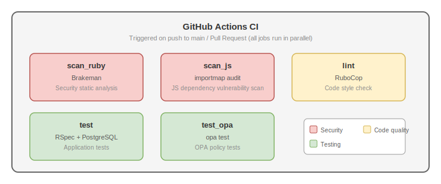

> 🇯🇵 [日本語版はこちら](ci.ja.md)

# CI (Continuous Integration)

This project uses **GitHub Actions** to automatically verify code quality, security, and correctness.

CI runs automatically on every push to the `main` branch and on every Pull Request.


## What is CI?

CI (Continuous Integration) is a development practice where code changes are frequently integrated into a shared repository, with automated tests and static analysis running on each change.

Benefits of CI include:

- Early detection of bugs and security issues
- Automatic enforcement of consistent code style
- Objective "pass/fail" status visible on Pull Requests
- Quality assurance before code reaches production


## Workflow Structure

The CI definition file is [`.github/workflows/ci.yml`](../.github/workflows/ci.yml).

Five jobs run **in parallel**:




## Trigger Conditions

```yaml
on:
  pull_request:
  push:
    branches: [ main ]
```

| Event | Description |
|---|---|
| `push` to `main` | Runs when code is pushed directly to the main branch |
| `pull_request` | Runs when a Pull Request is created or updated |


## Job Details

### 1. scan_ruby — Security Static Analysis (Brakeman)

| Item | Details |
|---|---|
| Tool | [Brakeman](https://brakemanscanner.org/) |
| Purpose | Detect security vulnerabilities in Rails application code via static analysis |
| Detection examples | SQL Injection, Cross-Site Scripting (XSS), Mass Assignment, etc. |

**How it works:**

Brakeman analyzes Rails source code without executing it, reporting any code that matches known vulnerability patterns. No database or server is required.

**Local execution:**

```bash
bundle exec brakeman --no-pager
```

**Pass condition:** `Security Warnings: 0`.


### 2. scan_js — JavaScript Dependency Vulnerability Scan

| Item | Details |
|---|---|
| Tool | [importmap audit](https://github.com/rails/importmap-rails) |
| Purpose | Check JavaScript dependencies for known vulnerabilities |

**How it works:**

This project uses importmap-rails to manage JavaScript. `importmap audit` checks the packages defined in `config/importmap.rb` against a vulnerability database.

**Local execution:**

```bash
bin/importmap audit
```

**Pass condition:** No vulnerabilities reported.


### 3. lint — Code Style Check (RuboCop)

| Item | Details |
|---|---|
| Tool | [RuboCop](https://rubocop.org/) |
| Purpose | Enforce consistent Ruby code style and quality |
| Config file | [`.rubocop.yml`](../.rubocop.yml) |

**How it works:**

RuboCop inspects source code against coding conventions and reports style violations. This project uses `rubocop-rails-omakase` (the official Rails recommended style) as its base.

**Exclusion settings:**

`.rubocop.yml` excludes the following directories because they do not contain Ruby files:

```yaml
AllCops:
  Exclude:
    - "opa/**/*"      # Rego policy files
    - ".github/**/*"  # GitHub Actions workflows (YAML)
```

**CI output format:**

In CI, the `-f github` option is used. This causes errors to appear as inline annotations on the Pull Request diff view in GitHub.

**Local execution:**

```bash
bundle exec rubocop
```

**Pass condition:** Zero offenses.


### 4. test — Application Tests (RSpec)

| Item | Details |
|---|---|
| Tool | [RSpec](https://rspec.info/) |
| Purpose | Automated tests for models, services, and request specs |
| Required services | PostgreSQL (service container) |

**How it works:**

GitHub Actions [service containers](https://docs.github.com/en/actions/using-containerized-services/about-service-containers) are used to start PostgreSQL within the job. Before running tests, `db:create db:migrate` builds the test database.

```yaml
services:
  postgres:
    image: postgres:17
    env:
      POSTGRES_PASSWORD: password
    ports:
      - 5432:5432
    options: >-
      --health-cmd="pg_isready -U postgres"
      --health-interval=5s
      --health-timeout=5s
      --health-retries=5
```

**Key points:**

- The `--health-cmd` option in `options` ensures the job waits until PostgreSQL is fully ready before proceeding
- An OPA service container is **not** needed. Test code uses WebMock to stub HTTP requests to OPA (see [testing.md](testing.md) for details)
- The `rails_user` role for RLS is automatically created during migration, so no additional DB initialization is required

**Environment variables:**

| Variable | Value | Description |
|---|---|---|
| `DB_HOST` | `localhost` | Connect to the PostgreSQL service container |
| `DB_SUPERUSER` | `postgres` | PostgreSQL superuser |
| `DB_SUPERUSER_PASSWORD` | `password` | PostgreSQL password |
| `RAILS_ENV` | `test` | Specify Rails test environment |
| `OPA_URL` | `http://localhost:8181/...` | OPA URL (stubbed by WebMock in practice) |

**Local execution:**

```bash
bundle exec rspec
```

**Pass condition:** All tests pass with zero failures.

> For detailed test design, see [testing.md](testing.md).


### 5. test_opa — OPA Policy Tests

| Item | Details |
|---|---|
| Tool | [OPA (Open Policy Agent)](https://www.openpolicyagent.org/) |
| Purpose | Unit tests for authorization policies written in Rego |
| Policy file | [`opa/policy/authz.rego`](../opa/policy/authz.rego) |
| Test file | [`opa/policy/authz_test.rego`](../opa/policy/authz_test.rego) |

**How it works:**

OPA has a built-in policy testing feature. Rules with the `test_` prefix are recognized as test cases and executed by the `opa test` command.

In CI, the [open-policy-agent/setup-opa](https://github.com/open-policy-agent/setup-opa) action installs the OPA binary, then runs the tests.

**Test cases (13 cases):**

| Role | Action | Expected | Test name |
|---|---|---|---|
| admin | read | ✅ Allow | `test_admin_allow_read` |
| admin | create | ✅ Allow | `test_admin_allow_create` |
| admin | update | ✅ Allow | `test_admin_allow_update` |
| admin | delete | ✅ Allow | `test_admin_allow_delete` |
| member | read | ✅ Allow | `test_member_allow_read` |
| member | create | ✅ Allow | `test_member_allow_create` |
| member | update | ✅ Allow | `test_member_allow_update` |
| member | delete | ❌ Deny | `test_member_deny_delete` |
| guest | read | ✅ Allow | `test_guest_allow_read` |
| guest | create | ❌ Deny | `test_guest_deny_create` |
| guest | update | ❌ Deny | `test_guest_deny_update` |
| guest | delete | ❌ Deny | `test_guest_deny_delete` |
| unknown | read | ❌ Deny | `test_unknown_role_deny` |

**OPA v1 syntax:**

OPA v1 requires the `if` keyword and `import rego.v1`. Both the policy file and test file use this syntax.

```rego
import rego.v1

test_admin_allow_read if { allow with input as {"user": {"role": "admin"}, "action": "read"} }
```

**Local execution:**

```bash
docker exec -i $(docker ps -qf "ancestor=openpolicyagent/opa:latest") opa test /policies/ -v
```

**Pass condition:** `PASS: 13/13`.

> For detailed OPA design, see [opa.md](opa.md).


## Dependabot — Automated Dependency Updates

In addition to CI jobs, [Dependabot](https://docs.github.com/en/code-security/dependabot) is configured for this project.

The definition file is [`.github/dependabot.yml`](../.github/dependabot.yml).

| Target | Check frequency | Description |
|---|---|---|
| `bundler` | Daily | Detects new versions and security patches for Ruby gems |
| `github-actions` | Daily | Detects updates for GitHub Actions (e.g., `actions/checkout`) |

When Dependabot finds an update, it automatically creates a Pull Request. CI runs on that PR as well, so breaking changes from updates are caught before merging.


## Checking CI Results

### On GitHub

1. Open the **Actions** tab in the repository
2. Click on the relevant workflow run
3. Click on each job name to view step-by-step logs

For Pull Requests, results are also visible in the **Checks** section at the bottom of the PR page.

### Local Pre-push Verification

It is recommended to run all checks locally before pushing:

```bash
# RSpec (application tests)
bundle exec rspec

# OPA policy tests
docker exec -i $(docker ps -qf "ancestor=openpolicyagent/opa:latest") opa test /policies/ -v

# Brakeman (security scan)
bundle exec brakeman --no-pager

# RuboCop (code style)
bundle exec rubocop

# importmap audit (JS dependency scan)
bin/importmap audit
```


## Job Summary

| Job | Tool | Category | Approx. duration |
|---|---|---|---|
| `scan_ruby` | Brakeman | Security | ~30 sec |
| `scan_js` | importmap audit | Security | ~20 sec |
| `lint` | RuboCop | Code quality | ~30 sec |
| `test` | RSpec + PostgreSQL | Testing | ~1-2 min |
| `test_opa` | OPA | Testing | ~20 sec |

All jobs run in parallel, so the total CI duration depends on the slowest job (typically `test`).
