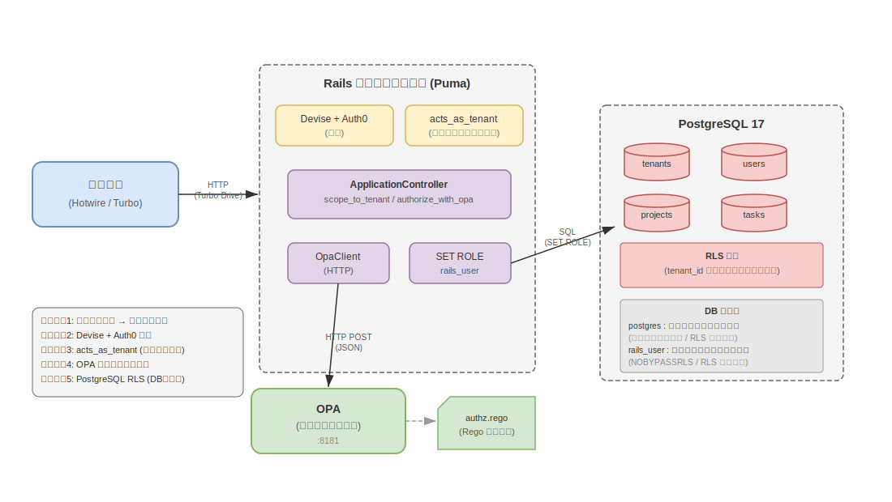
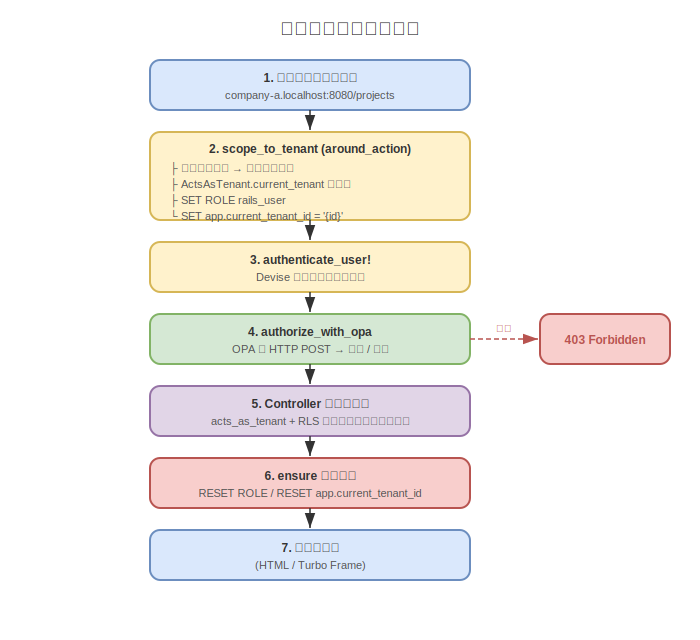
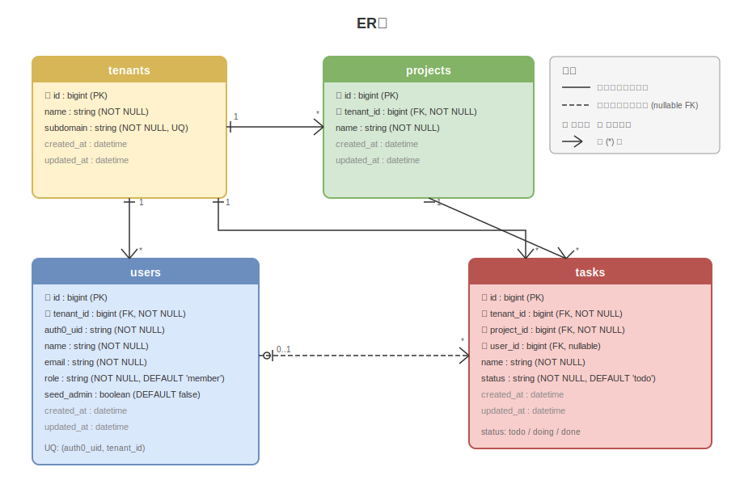

> 🇺🇸 [English version here](design.md)

# 設計ドキュメント: Rails Hotwire × acts_as_tenant × OPA マルチテナント タスク管理アプリ

## 1. プロジェクト概要

B2B向けのプロジェクト・タスク管理ツールである。
セキュリティ（マルチテナント分離、RLS、OPA認可）とHotwireによるモダンなUXにフォーカスしたMVP。

### 画面構成（3画面）

| #   | 画面           | パス                              | 説明                             |
| --- | -------------- | --------------------------------- | -------------------------------- |
| 1   | プロジェクト一覧 | `/projects`(ルート)             | テナント内の全プロジェクトを一覧表示 |
| 2   | タスク一覧     | `/projects/:project_id/tasks`     | プロジェクト配下のタスク一覧     |
| 3   | タスク詳細     | `/projects/:project_id/tasks/:id` | タスク詳細とステータス更新       |


## 2. 技術スタック

| カテゴリ              | 技術                                 | バージョン / 詳細                    |
| --------------------- | ------------------------------------ | ------------------------------------ |
| 言語                  | Ruby                                 | 3.4.9                                |
| フレームワーク        | Ruby on Rails                        | 8.1.3                                |
| データベース          | PostgreSQL                           | 17                                   |
| フロントエンド        | Hotwire(Turbo Drive / Turbo Frames)  | importmap経由                        |
| アセットパイプライン  | Propshaft                            | -                                    |
| 認証                  | Devise + omniauth-auth0              | Auth0 Organizations向け設計          |
| 認可                  | Open Policy Agent(OPA)               | Dockerコンテナとして実行             |
| マルチテナンシー      | acts_as_tenant                       | アプリケーション層のスコープ制御     |
| DB行レベルセキュリティ | PostgreSQL RLS                      | DB層の多層防御                       |
| JWT                   | ruby-jwt                             | トークン検証                         |
| テスト高速化          | test-prof                            | 認可テスト用                         |
| テストフレームワーク  | rspec-rails                          | BDDスタイルのテスト                  |
| テストデータ          | factory_bot_rails                    | 宣言的なテストデータ生成             |
| テストマッチャー      | shoulda-matchers                     | バリデーション/アソシエーションのワンライナーテスト |
| HTTPスタブ            | webmock                              | 外部HTTPリクエストのスタブ(OPA)      |
| CI                    | GitHub Actions                       | Brakeman / importmap audit / RuboCop |


## 3. アーキテクチャ

### 3.1 全体構成



### 3.2 DevContainer構成

`docker-compose.yml`で3つのサービスを起動する。

| サービス | イメージ                        | ポート | 役割                  |
| -------- | ------------------------------- | ------ | --------------------- |
| app      | ruby:3.4(カスタムDockerfile)    | 8080   | Railsアプリケーション |
| db       | postgres:17                     | 5432   | データベース          |
| opa      | openpolicyagent/opa:latest      | 8181   | ポリシーエンジン      |

### 3.3 リクエストフロー




## 4. データベース設計

### 4.1 ER図



### 4.2 テーブル定義

#### tenants

| カラム     | 型       | 制約             | 説明             |
| ---------- | -------- | ---------------- | ---------------- |
| id         | bigint   | PK               |                  |
| name       | string   | NOT NULL         | テナント名       |
| subdomain  | string   | NOT NULL, UNIQUE | サブドメイン識別子 |
| created_at | datetime | NOT NULL         |                  |
| updated_at | datetime | NOT NULL         |                  |

#### users

| カラム     | 型       | 制約                                 | 説明                           |
| ---------- | -------- | ------------------------------------ | ------------------------------ |
| id         | bigint   | PK                                   |                                |
| tenant_id  | bigint   | NOT NULL, FK(tenants)                | 所属テナント                   |
| auth0_uid  | string   | NOT NULL, UNIQUE(tenant_id)          | Auth0ユーザーID                |
| name       | string   | NOT NULL                             | 表示名                         |
| email      | string   | NOT NULL                             | メールアドレス                 |
| role       | string   | NOT NULL, DEFAULT 'member'           | 権限ロール                     |
| seed_admin | boolean  | NOT NULL, DEFAULT false              | 初期管理者ロールの保護         |
| created_at | datetime | NOT NULL                             |                                |
| updated_at | datetime | NOT NULL                             |                                |

ロール種別

| ロール | 説明                             |
| ------ | -------------------------------- |
| admin  | 管理者 — 全操作可能              |
| member | 一般社員 — 閲覧、作成、更新     |
| guest  | 外部協力者 — 閲覧のみ           |

#### projects

| カラム     | 型       | 制約                  | 説明         |
| ---------- | -------- | --------------------- | ------------ |
| id         | bigint   | PK                    |              |
| tenant_id  | bigint   | NOT NULL, FK(tenants) | 所属テナント |
| name       | string   | NOT NULL              | プロジェクト名 |
| created_at | datetime | NOT NULL              |              |
| updated_at | datetime | NOT NULL              |              |

#### tasks

| カラム     | 型       | 制約                     | 説明                         |
| ---------- | -------- | ------------------------ | ---------------------------- |
| id         | bigint   | PK                       |                              |
| tenant_id  | bigint   | NOT NULL, FK(tenants)    | 所属テナント                 |
| project_id | bigint   | NOT NULL, FK(projects)   | 所属プロジェクト             |
| user_id    | bigint   | FK(users), nullable      | 担当者（未割当可）           |
| name       | string   | NOT NULL                 | タスク名                     |
| status     | string   | NOT NULL, DEFAULT 'todo' | ステータス                   |
| created_at | datetime | NOT NULL                 |                              |
| updated_at | datetime | NOT NULL                 |                              |

ステータス種別: `todo` / `doing` / `done`


## 5. マルチテナント設計

### 5.1 テナント分離の方針

カラムベースの分離を採用している。全テーブルに`tenant_id`を持たせ、アプリケーション層とDB層の両方で分離を実現する。

### 5.2 テナント識別

サブドメインベースの識別を使用している。`request.subdomain`からテナントを解決する。

- ローカル: `company-a.localhost:8080`
- 開発環境では`config.action_dispatch.tld_length = 0`を設定し、localhostでのサブドメイン認識を有効化している

### 5.3 acts_as_tenant(アプリケーション層)

`ApplicationController`で`set_current_tenant_through_filter`を宣言し、`around_action :scope_to_tenant`でリクエストごとにテナントを設定する。

各モデルに`acts_as_tenant :tenant`を宣言することで、ActiveRecordクエリに自動的に`WHERE tenant_id = ?`が付加される。

対象モデル: `User`, `Project`, `Task`

### 5.4 テナントスコープの一時的な無効化

`ActsAsTenant.without_tenant`は`db/seeds.rb`でのみ使用している。本番のリクエストパスでは使用しない。


## 6. PostgreSQL RLS(Row Level Security)設計

acts_as_tenantによるアプリ層の分離に加え、RLSがDB層で多層防御を提供する。アプリ層のスコーピングにバグがあっても、DBが他テナントのデータへのアクセスをブロックする。

- DBはデフォルトで`postgres`（スーパーユーザー、BYPASSRLS）として接続
- リクエスト中は`SET ROLE`で`rails_user`（NOBYPASSRLS）に切り替え
- RLSポリシーがテナントスコープの全テーブルで`tenant_id = current_setting('app.current_tenant_id')`を強制
- `schema_migrations`と`ar_internal_metadata`はRLS対象外
- `rails_user`への`GRANT`権限はRakeタスクフック（`lib/tasks/rls.rake`）により`db:migrate`および`db:schema:load`の後に自動適用

> 詳しくは[rls.ja.md](rls.ja.md)を参照。


## 7. OPA認可設計

OPAはテナント内のロールベース権限（垂直方向のアクセス制御）を担当する。テナント間の水平方向の分離はRLSとacts_as_tenantが担う。

- OPAはDockerコンテナとして実行し、`http://opa:8181/v1/data/authz/allow`でRegoポリシーを評価する
- `ApplicationController`の`before_action :authorize_with_opa`で毎リクエストOPAに問い合わせる
- フェイルセーフ設計: OPAに到達できない場合はアクセスを拒否する

| ロール \ アクション | read | create | update | delete |
| ------------------- | ---- | ------ | ------ | ------ |
| admin               | ○    | ○      | ○      | ○      |
| member              | ○    | ○      | ○      | ×      |
| guest               | ○    | ×      | ×      | ×      |

> 詳しくは[opa.ja.md](opa.ja.md)を参照。


## 8. 認証設計

Devise + omniauth-auth0によるOAuth2認証を採用している。

- Auth0は本人確認のみ担当。パスワードはアプリに保存しない
- ロール管理はRails内で完結（`users.role`カラム）
- シード管理者は`seed_admin: true`で事前作成し、初回ログイン時にメールマッチでAuth0とリンクする
- Auth0コールバックで作成される新規ユーザーには`guest`ロールを割り当てる
- コールバック時にサブドメインで正しいテナントにスコーピングする
- ログインページ(`/dev_session/new`)は設定に応じてAuth0ボタンまたは開発用ユーザー選択リストを表示する

> 詳しくは[auth0.ja.md](auth0.ja.md)を参照。


## 9. Hotwire設計

### 9.1 Turbo Drive

全ページナビゲーションでTurbo Driveを有効化している。`<body>`を差し替えてSPAライクなスムーズな遷移を実現する。importmapで`@hotwired/turbo-rails`を読み込んでいる。

### 9.2 Turbo Frames

タスクのステータス更新にTurbo Framesを使用し、フルリロードなしの部分更新を実現している。

#### タスク一覧でのステータス更新

各タスク行を`turbo_frame_tag dom_id(task)`でラップしている。ステータスのセレクトボックスを変更すると`requestSubmit()`でフォームが送信され、サーバーが`_task.html.erb`パーシャルを返す。該当行のみが更新される。

#### タスク詳細でのステータス更新

ステータスセクションを`turbo_frame_tag "task_status"`でラップしている。変更するとサーバーが`_task_status.html.erb`パーシャルを返す。`TasksController#update`は`turbo_frame_request_id`を確認してどのパーシャルを返すか判定する。

### 9.3 Stimulus

Stimulusコントローラの基盤は`app/javascript/controllers/`に用意してあるが、カスタムコントローラは未実装である。ステータス変更はインラインJS（`onchange: "this.form.requestSubmit()"`）で対応している。


## 10. ルーティング

```ruby
root "projects#index"

resources :projects, only: [:index] do
  resources :tasks, only: [:index, :show, :update]
end
```

| メソッド | パス                            | アクション     | 説明             |
| -------- | ------------------------------- | -------------- | ---------------- |
| GET      | /projects                       | projects#index | プロジェクト一覧 |
| GET      | /projects/:project_id/tasks     | tasks#index    | タスク一覧       |
| GET      | /projects/:project_id/tasks/:id | tasks#show     | タスク詳細       |
| PATCH    | /projects/:project_id/tasks/:id | tasks#update   | タスクステータス更新 |

MVPとして最小限のCRUDのみ公開している。create / destroyは現時点ではスコープ外である。


## 11. ディレクトリ構成

```
rails_hotwire_opa_tenant_manager/
├── .devcontainer/
│   ├── Dockerfile          # Ruby 3.4 + PostgreSQLクライアント
│   ├── devcontainer.json   # VS Code DevContainer設定
│   └── docker-compose.yml  # 3サービス: app / db / opa
├── .github/
│   └── workflows/
│       └── ci.yml          # Brakeman / importmap audit / RuboCop
├── app/
│   ├── controllers/
│   │   ├── concerns/
│   │   ├── users/
│   │   │   ├── omniauth_callbacks_controller.rb  # Auth0コールバック
│   │   │   └── sessions_controller.rb            # サインアウト
│   │   ├── application_controller.rb  # テナント制御、認証、OPA認可
│   │   ├── dev_sessions_controller.rb # ログインページ
│   │   ├── projects_controller.rb
│   │   └── tasks_controller.rb
│   ├── models/
│   │   ├── tenant.rb       # has_many :users, :projects, :tasks
│   │   ├── user.rb         # acts_as_tenant, devise :omniauthable
│   │   ├── project.rb      # acts_as_tenant
│   │   └── task.rb         # acts_as_tenant, belongs_to :project/:user
│   ├── services/
│   │   └── opa_client.rb   # OPA HTTPクライアント
│   └── views/
│       ├── layouts/
│       │   └── application.html.erb
│       ├── projects/
│       │   └── index.html.erb
│       └── tasks/
│           ├── _task.html.erb          # タスク行パーシャル(Turbo Frame)
│           ├── _task_status.html.erb   # ステータスパーシャル(Turbo Frame)
│           ├── index.html.erb
│           └── show.html.erb
├── config/
│   ├── database.yml        # postgres(スーパーユーザー)として接続
│   ├── initializers/
│   │   └── devise.rb       # Auth0 OmniAuth設定
│   └── routes.rb
├── db/
│   ├── migrate/
│   │   ├── *_create_tenants.rb
│   │   ├── *_create_users.rb
│   │   ├── *_create_projects.rb
│   │   ├── *_create_tasks.rb
│   │   ├── *_create_rls_role.rb        # rails_userロール作成
│   │   └── *_enable_rls_policies.rb    # RLS有効化 + ポリシー作成
│   ├── schema.rb
│   └── seeds.rb            # 開発用シードデータ
├── docs/
│   ├── README.md           # ドキュメントインデックス
│   ├── design.md           # 本設計ドキュメント
│   ├── rls.md              # RLS詳細
│   ├── opa.md              # OPA詳細
│   ├── auth0.md            # Auth0認証
│   ├── testing.md          # テスト戦略と構成
│   └── images/             # ダイアグラム
├── lib/
│   └── tasks/
│       └── rls.rake        # db:migrate / db:schema:load後の自動GRANT
├── spec/
│   ├── factories/          # FactoryBot定義
│   ├── models/             # モデルスペック
│   ├── services/           # サービススペック(OpaClient)
│   ├── requests/           # リクエストスペック
│   ├── support/            # 共有ヘルパー(OPAスタブ)
│   ├── rails_helper.rb
│   └── spec_helper.rb
└── opa/
    └── policy/
        └── authz.rego      # OPA認可ポリシー
```


## 12. セキュリティ設計サマリー

### 多層防御アーキテクチャ

```
[レイヤー1] サブドメインによるテナント識別
    ↓
[レイヤー2] Devise + Auth0による認証
    ↓
[レイヤー3] acts_as_tenantによるアプリ層のテナント分離
    ↓
[レイヤー4] OPAによるロールベースの認可
    ↓
[レイヤー5] PostgreSQL RLSによるDB層のテナント分離
```

| レイヤー              | 何を防ぐか                          | 実装                                 |
| --------------------- | ----------------------------------- | ------------------------------------ |
| テナント識別          | 誤ったテナントへのアクセス          | サブドメイン → テナント検索          |
| 認証                  | 未認証アクセス                      | Devise + Auth0                       |
| アプリ層の分離        | テナント間のクエリ                  | acts_as_tenant(自動WHERE)            |
| ロール認可            | 権限外の操作                        | OPA(Regoポリシー)                    |
| DB層の分離            | アプリのバグによるデータ漏洩        | PostgreSQL RLS                       |


## 13. 環境変数

| 変数                  | 説明                                             |
| --------------------- | ------------------------------------------------ |
| DB_HOST               | PostgreSQLホスト                                 |
| DB_PORT               | PostgreSQLポート                                 |
| DB_SUPERUSER          | DB接続ユーザー（スーパーユーザー）               |
| DB_SUPERUSER_PASSWORD | DB接続パスワード                                 |
| RLS_ROLE              | RLS制限ロール名                                  |
| RLS_ROLE_PASSWORD     | RLSロールパスワード                              |
| OPA_URL               | OPAエンドポイント                                |
| AUTH0_CLIENT_ID       | Auth0クライアントID                              |
| AUTH0_CLIENT_SECRET   | Auth0クライアントシークレット                    |
| AUTH0_DOMAIN          | Auth0ドメイン                                    |
| SEED_ADMIN_EMAIL_COMPANY_A | Company A初期管理者のメール                 |
| SEED_ADMIN_EMAIL_COMPANY_B | Company B初期管理者のメール                 |


## 14. シードデータ

2テナントと初期管理者をシードで作成する。

| テナント  | サブドメイン | ユーザー        | プロジェクト                      | タスク  |
| --------- | ------------ | --------------- | --------------------------------- | ------- |
| Company A | company-a    | Admin A(admin)  | Website Redesign, API Development | 5つ    |
| Company B | company-b    | Admin B(admin)  | Mobile App                        | 2つ    |

シード管理者は`seed_admin: true`でロール変更不可としている。
管理者メールは環境変数（`SEED_ADMIN_EMAIL_COMPANY_A`, `SEED_ADMIN_EMAIL_COMPANY_B`）から読み込む。
追加ユーザーはAuth0初回ログイン時に`guest`として作成される。


## 15. CI/CD

GitHub Actionsで以下のジョブを自動実行している。

| ジョブ    | 内容                                                 |
| --------- | ---------------------------------------------------- |
| scan_ruby | Brakemanでセキュリティ静的解析                       |
| scan_js   | importmap auditでJS依存関係の脆弱性チェック          |
| lint      | RuboCopでコードスタイルチェック                      |
| test      | RSpecテストスイート                                  |


## 16. 当初仕様からの変更点

| 項目               | 当初仕様                                    | 実装                                                                                                        |
| ------------------ | ------------------------------------------- | ----------------------------------------------------------------------------------------------------------- |
| Pumaポート         | 8080                                        | 3000(Pumaデフォルト)。docker-composeでポートマッピング8080:8080を設定                                        |
| DB接続             | マイグレーションとランタイムで別ユーザー    | 単一接続(postgres) + `SET ROLE`で動的切り替え。コネクションプール管理がシンプルになる                         |
| Stimulus           | 使用対象として言及                          | 基盤のみ。ステータス変更はインラインJS(`onchange="this.form.requestSubmit()"`)で対応                         |
| タスクCRUD         | 特に制限なし                                | MVPとしてindex / show / updateのみ。create / destroyは未実装                                                 |
| Railsモジュール名  | 未指定                                      | `Workspace`として生成(`config/application.rb`)                                                               |
