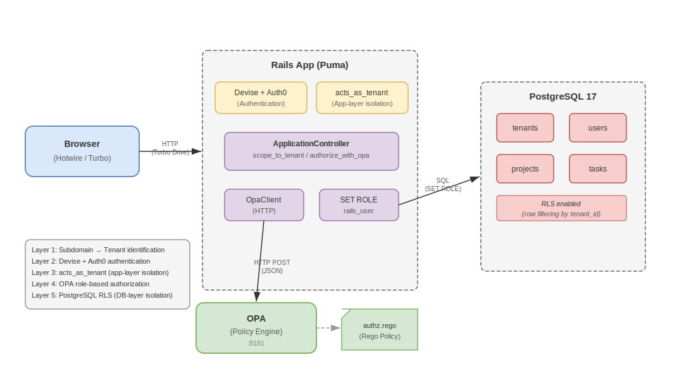
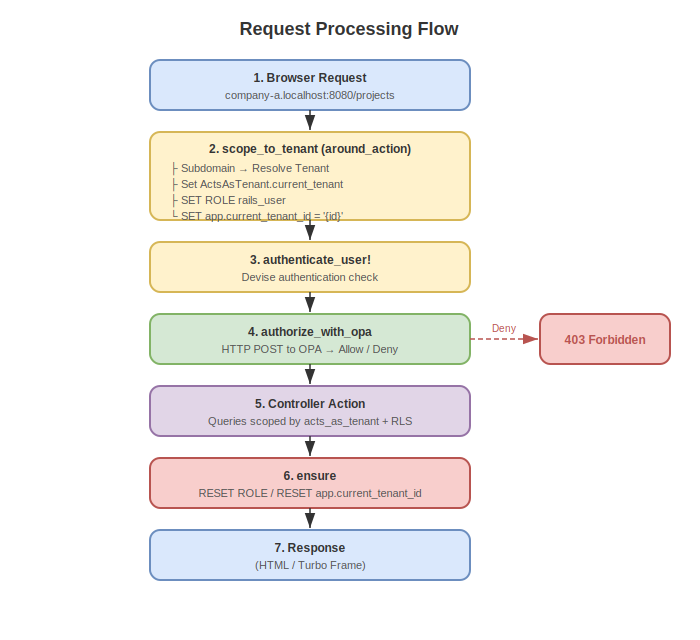

# Design Document: Rails Hotwire × acts_as_tenant × OPA Multi-Tenant Task Management App

## 1. Project Overview

A B2B project and task management tool.  
An MVP focused on security (multi-tenant isolation, RLS, OPA authorization) and a modern UX powered by Hotwire.

### Screen Structure (3 Screens)

| #   | Screen       | Path                              | Description                              |
| --- | ------------ | --------------------------------- | ---------------------------------------- |
| 1   | Project list | `/projects` (root)                | Lists all projects within the tenant     |
| 2   | Task list    | `/projects/:project_id/tasks`     | Lists tasks under a project              |
| 3   | Task detail  | `/projects/:project_id/tasks/:id` | Task detail view and status update       |

---

## 2. Technology Stack

| Category              | Technology                           | Version / Details                    |
| --------------------- | ------------------------------------ | ------------------------------------ |
| Language              | Ruby                                 | 3.4.9                                |
| Framework             | Ruby on Rails                        | 8.1.3                                |
| Database              | PostgreSQL                           | 17                                   |
| Frontend              | Hotwire (Turbo Drive / Turbo Frames) | Via importmap                        |
| Asset pipeline        | Propshaft                            | -                                    |
| Authentication        | Devise + omniauth-auth0              | Designed for Auth0 Organizations     |
| Authorization         | Open Policy Agent (OPA)              | Runs as a Docker container           |
| Multi-tenancy         | acts_as_tenant                       | Application-layer scope control      |
| DB row-level security | PostgreSQL RLS                       | Defense in depth at the DB layer     |
| JWT                   | ruby-jwt                             | Token verification                   |
| Test acceleration     | test-prof                            | For authorization tests              |
| CI                    | GitHub Actions                       | Brakeman / importmap audit / RuboCop |

---

## 3. Architecture

### 3.1 Overall Structure



### 3.2 DevContainer Configuration

Three services are started via `docker-compose.yml`:

| Service | Image                         | Port | Role                  |
| ------- | ----------------------------- | ---- | --------------------- |
| app     | ruby:3.4 (custom Dockerfile)  | 8080 | Rails application     |
| db      | postgres:17                   | 5432 | Database              |
| opa     | openpolicyagent/opa:latest    | 8181 | Policy engine         |

### 3.3 Request Flow



---

## 4. Database Design

### 4.1 ER Diagram

```
tenants 1──* users
tenants 1──* projects
tenants 1──* tasks
projects 1──* tasks
users 1──* tasks (optional)
```

### 4.2 Table Definitions

#### tenants

| Column     | Type     | Constraints      | Description          |
| ---------- | -------- | ---------------- | -------------------- |
| id         | bigint   | PK               |                      |
| name       | string   | NOT NULL         | Tenant name          |
| subdomain  | string   | NOT NULL, UNIQUE | Subdomain identifier |
| created_at | datetime | NOT NULL         |                      |
| updated_at | datetime | NOT NULL         |                      |

#### users

| Column     | Type     | Constraints                | Description     |
| ---------- | -------- | -------------------------- | --------------- |
| id         | bigint   | PK                         |                 |
| tenant_id  | bigint   | NOT NULL, FK(tenants)      | Owning tenant   |
| auth0_uid  | string   | NOT NULL, UNIQUE           | Auth0 user ID   |
| name       | string   | NOT NULL                   | Display name    |
| email      | string   | NOT NULL                   | Email address   |
| role       | string   | NOT NULL, DEFAULT 'member' | Permission role |
| created_at | datetime | NOT NULL                   |                 |
| updated_at | datetime | NOT NULL                   |                 |

Role types:

| Role   | Description                              |
| ------ | ---------------------------------------- |
| admin  | Administrator — full access              |
| member | Regular employee — read, create, update  |
| guest  | External collaborator — read only        |

#### projects

| Column     | Type     | Constraints           | Description  |
| ---------- | -------- | --------------------- | ------------ |
| id         | bigint   | PK                    |              |
| tenant_id  | bigint   | NOT NULL, FK(tenants) | Owning tenant |
| name       | string   | NOT NULL              | Project name |
| created_at | datetime | NOT NULL              |              |
| updated_at | datetime | NOT NULL              |              |

#### tasks

| Column     | Type     | Constraints              | Description                  |
| ---------- | -------- | ------------------------ | ---------------------------- |
| id         | bigint   | PK                       |                              |
| tenant_id  | bigint   | NOT NULL, FK(tenants)    | Owning tenant                |
| project_id | bigint   | NOT NULL, FK(projects)   | Owning project               |
| user_id    | bigint   | FK(users), nullable      | Assignee (can be unassigned) |
| name       | string   | NOT NULL                 | Task name                    |
| status     | string   | NOT NULL, DEFAULT 'todo' | Status                       |
| created_at | datetime | NOT NULL                 |                              |
| updated_at | datetime | NOT NULL                 |                              |

Status types: `todo` / `doing` / `done`

---

## 5. Multi-Tenant Design

### 5.1 Tenant Isolation Strategy

**Column-based isolation** — All tables include a `tenant_id` column, with dual isolation at both the application and database layers.

### 5.2 Tenant Identification

Subdomain-based identification is used. The tenant is resolved from `request.subdomain`.

- Local: `company-a.localhost:8080`
- `config.action_dispatch.tld_length = 0` is set in the development environment to enable subdomain recognition on localhost

### 5.3 acts_as_tenant (Application Layer)

`set_current_tenant_through_filter` is declared in `ApplicationController`, and `around_action :scope_to_tenant` sets the tenant on each request.

Each model declares `acts_as_tenant :tenant`, which automatically appends `WHERE tenant_id = ?` to Active Record queries.

Target models: `User`, `Project`, `Task`

### 5.4 Temporarily Disabling Tenant Scope

`ActsAsTenant.without_tenant` is used only in `db/seeds.rb` to bypass tenant scoping. It is never used in production request paths.

---

## 6. PostgreSQL RLS (Row Level Security) Design

In addition to application-layer isolation via acts_as_tenant, RLS provides defense in depth at the database layer. Even if a bug exists in the application-layer scoping, the database prevents access to other tenants' data.

- DB connects as `postgres` (superuser, BYPASSRLS) by default
- During requests, switches to `rails_user` (NOBYPASSRLS) via `SET ROLE`
- RLS policies enforce `tenant_id = current_setting('app.current_tenant_id')` on all tenant-scoped tables
- `schema_migrations` and `ar_internal_metadata` are excluded from RLS

> For a detailed explanation of RLS concepts, policies, and implementation, see [rls.md](rls.md).

---

## 7. OPA Authorization Design

OPA handles **vertical access control** — role-based permissions within a tenant — while RLS and acts_as_tenant handle horizontal isolation between tenants.

- OPA runs as a Docker container, evaluating Rego policies at `http://opa:8181/v1/data/authz/allow`
- `ApplicationController` calls OPA on every request via `before_action :authorize_with_opa`
- Fail-safe design: access is denied if OPA is unreachable

| Role \ Action | read | create | update | delete |
| ------------- | ---- | ------ | ------ | ------ |
| admin         | ✅   | ✅     | ✅     | ✅     |
| member        | ✅   | ✅     | ✅     | ❌     |
| guest         | ✅   | ❌     | ❌     | ❌     |

> For a detailed explanation of OPA concepts, Rego policies, and integration, see [opa.md](opa.md).

---

## 8. Authentication Design

OAuth2 authentication via Devise + omniauth-auth0, designed for Auth0 Organizations.

- Auth0 handles all credential verification — no passwords are stored in the application
- Users are automatically created on first login with the `member` role
- Subdomain is used to scope users to the correct tenant during the callback
- In development, a fallback auto-signs in the first tenant user when Auth0 is not configured

> For a detailed explanation of the Auth0 flow, Devise configuration, and multi-tenant authentication, see [auth0.md](auth0.md).

---

## 9. Hotwire Design

### 9.1 Turbo Drive

Turbo Drive is enabled for all page navigations. It replaces the `<body>` to achieve SPA-like smooth transitions. Loaded via importmap with `@hotwired/turbo-rails`.

### 9.2 Turbo Frames

Turbo Frames are used for task status updates, enabling partial page updates without full reloads.

#### Status Update on Task List

Each task row is wrapped in `turbo_frame_tag dom_id(task)`. When the status select box changes, `requestSubmit()` submits the form. The server returns the `_task.html.erb` partial, updating only the affected row.

#### Status Update on Task Detail

The status section is wrapped in `turbo_frame_tag "task_status"`. On change, the server returns the `_task_status.html.erb` partial. `TasksController#update` checks `turbo_frame_request_id` to determine which partial to render.

### 9.3 Stimulus

The Stimulus controller foundation is configured (`app/javascript/controllers/`). No custom controllers are implemented yet; status changes use inline JS (`onchange: "this.form.requestSubmit()"`).

---

## 10. Routing

```ruby
root "projects#index"

resources :projects, only: [:index] do
  resources :tasks, only: [:index, :show, :update]
end
```

| Method | Path                            | Action         | Description          |
| ------ | ------------------------------- | -------------- | -------------------- |
| GET    | /projects                       | projects#index | Project list         |
| GET    | /projects/:project_id/tasks     | tasks#index    | Task list            |
| GET    | /projects/:project_id/tasks/:id | tasks#show     | Task detail          |
| PATCH  | /projects/:project_id/tasks/:id | tasks#update   | Task status update   |

Only minimal CRUD is exposed for the MVP. create / destroy are currently out of scope.

---

## 11. Directory Structure

```
rails_hotwire_opa_tenant_manager/
├── .devcontainer/
│   ├── Dockerfile          # Ruby 3.4 + PostgreSQL client
│   ├── devcontainer.json   # VS Code DevContainer configuration
│   └── docker-compose.yml  # 3 services: app / db / opa
├── .github/
│   └── workflows/
│       └── ci.yml          # Brakeman / importmap audit / RuboCop
├── app/
│   ├── controllers/
│   │   ├── concerns/
│   │   ├── users/
│   │   │   ├── omniauth_callbacks_controller.rb  # Auth0 callback
│   │   │   └── sessions_controller.rb            # Sign out
│   │   ├── application_controller.rb  # Tenant control, auth, OPA authz
│   │   ├── projects_controller.rb
│   │   └── tasks_controller.rb
│   ├── models/
│   │   ├── tenant.rb       # has_many :users, :projects, :tasks
│   │   ├── user.rb         # acts_as_tenant, devise :omniauthable
│   │   ├── project.rb      # acts_as_tenant
│   │   └── task.rb         # acts_as_tenant, belongs_to :project/:user
│   ├── services/
│   │   └── opa_client.rb   # OPA HTTP client
│   └── views/
│       ├── layouts/
│       │   └── application.html.erb
│       ├── projects/
│       │   └── index.html.erb
│       └── tasks/
│           ├── _task.html.erb          # Task row partial (Turbo Frame)
│           ├── _task_status.html.erb   # Status partial (Turbo Frame)
│           ├── index.html.erb
│           └── show.html.erb
├── config/
│   ├── database.yml        # Connects as postgres (superuser)
│   ├── initializers/
│   │   └── devise.rb       # Auth0 OmniAuth configuration
│   └── routes.rb
├── db/
│   ├── migrate/
│   │   ├── *_create_tenants.rb
│   │   ├── *_create_users.rb
│   │   ├── *_create_projects.rb
│   │   ├── *_create_tasks.rb
│   │   ├── *_create_rls_role.rb        # rails_user role creation
│   │   └── *_enable_rls_policies.rb    # RLS activation + policy creation
│   ├── schema.rb
│   └── seeds.rb            # Development seed data
├── docs/
│   ├── README.md           # Documentation index
│   ├── design.md           # This design document
│   ├── rls.md              # RLS detailed documentation
│   ├── opa.md              # OPA detailed documentation
│   ├── auth0.md            # Auth0 authentication documentation
│   └── images/             # Architecture and flow diagrams
└── opa/
    └── policy/
        └── authz.rego      # OPA authorization policy
```

---

## 12. Security Design Summary

### Defense in Depth Architecture

```
[Layer 1] Tenant identification via subdomain
    ↓
[Layer 2] Authentication via Devise + Auth0
    ↓
[Layer 3] Application-layer tenant isolation via acts_as_tenant
    ↓
[Layer 4] Role-based authorization via OPA
    ↓
[Layer 5] Database-layer tenant isolation via PostgreSQL RLS
```

| Layer                 | Protects Against                  | Implementation                       |
| --------------------- | --------------------------------- | ------------------------------------ |
| Tenant identification | Wrong tenant access               | Subdomain → Tenant lookup            |
| Authentication        | Unauthenticated access            | Devise + Auth0                       |
| App-layer isolation   | Cross-tenant queries              | acts_as_tenant (automatic WHERE)     |
| Role authorization    | Unauthorized operations           | OPA (Rego policies)                  |
| DB-layer isolation    | Data leaks from application bugs  | PostgreSQL RLS                       |

---

## 13. Environment Variables

| Variable              | Default                             | Description                          |
| --------------------- | ----------------------------------- | ------------------------------------ |
| DB_HOST               | db                                  | PostgreSQL host                      |
| DB_PORT               | 5432                                | PostgreSQL port                      |
| DB_SUPERUSER          | postgres                            | DB connection user (superuser)       |
| DB_SUPERUSER_PASSWORD | password                            | DB connection password               |
| RLS_ROLE              | rails_user                          | RLS-restricted role name             |
| RLS_ROLE_PASSWORD     | rails_password                      | RLS role password                    |
| OPA_URL               | http://opa:8181/v1/data/authz/allow | OPA endpoint                         |
| AUTH0_CLIENT_ID       | -                                   | Auth0 client ID                      |
| AUTH0_CLIENT_SECRET   | -                                   | Auth0 client secret                  |
| AUTH0_DOMAIN          | -                                   | Auth0 domain                         |

---

## 14. Seed Data

Two tenants of development and testing data are seeded:

| Tenant    | Subdomain | Users                                               | Projects                          | Tasks   |
| --------- | --------- | --------------------------------------------------- | --------------------------------- | ------- |
| Company A | company-a | Admin A (admin), Member A (member), Guest A (guest) | Website Redesign, API Development | 5 tasks |
| Company B | company-b | Admin B (admin)                                     | Mobile App                        | 2 tasks |

---

## 15. CI/CD

The following jobs run automatically via GitHub Actions:

| Job       | Description                                          |
| --------- | ---------------------------------------------------- |
| scan_ruby | Security static analysis with Brakeman               |
| scan_js   | JS dependency vulnerability check with importmap audit |
| lint      | Code style check with RuboCop                        |

---

## 16. Deviations from Original Specification

| Item               | Original Specification                          | Implementation                                                                                              |
| ------------------ | ----------------------------------------------- | ----------------------------------------------------------------------------------------------------------- |
| Puma port          | 8080                                            | 3000 (Puma default). Port mapping 8080:8080 is configured in docker-compose                                 |
| DB connection      | Separate users for migration and runtime        | Single connection (postgres) + dynamic switching via `SET ROLE`. Simplifies connection pool management       |
| Stimulus           | Mentioned as a usage target                     | Foundation only. Status changes use inline JS (`onchange="this.form.requestSubmit()"`)                      |
| Task CRUD          | No specific restrictions                        | MVP exposes only index / show / update. create / destroy are not implemented                                |
| Rails module name  | Not specified                                   | Generated as `Workspace` (`config/application.rb`)                                                          |
