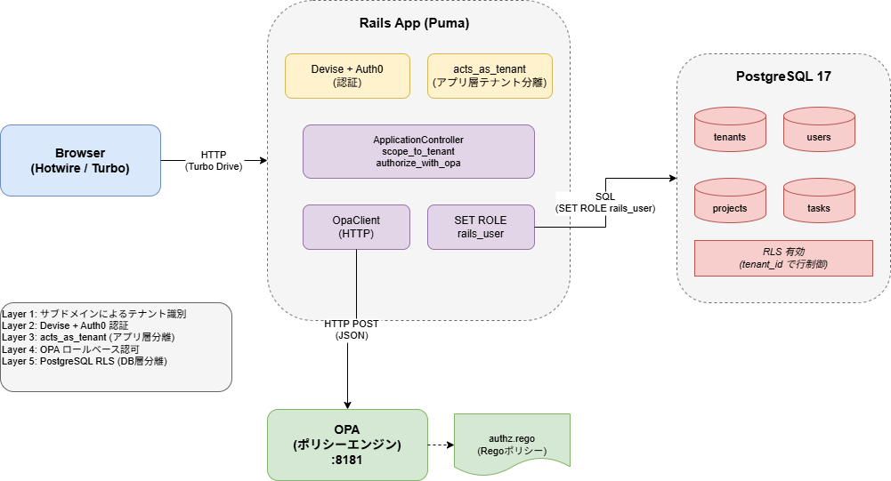
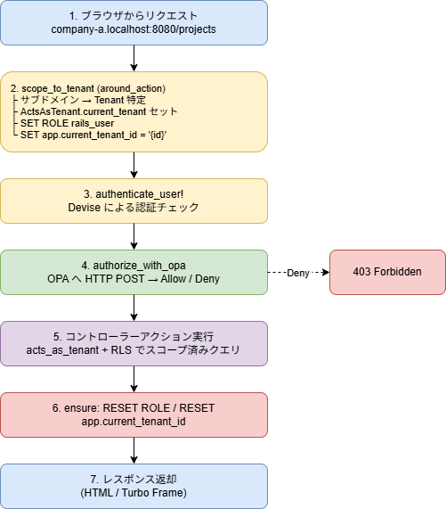

# 設計書：Rails Hotwire × acts_as_tenant × OPA マルチテナントタスク管理アプリ

## 1. プロジェクト概要

B2B向けプロジェクト・タスク管理ツール。  
セキュリティ（マルチテナント分離・RLS・OPA認可）と Hotwire によるモダンUXに特化したMVP。

### 画面構成（3画面）

| #   | 画面             | パス                              | 説明                                 |
| --- | ---------------- | --------------------------------- | ------------------------------------ |
| 1   | プロジェクト一覧 | `/projects` (root)                | テナント内の全プロジェクトを一覧表示 |
| 2   | タスク一覧       | `/projects/:project_id/tasks`     | プロジェクト配下のタスクを一覧表示   |
| 3   | タスク詳細       | `/projects/:project_id/tasks/:id` | タスクの詳細表示・ステータス変更     |

---

## 2. 技術スタック

| カテゴリ               | 技術                                 | バージョン/詳細                      |
| ---------------------- | ------------------------------------ | ------------------------------------ |
| 言語                   | Ruby                                 | 3.4.9                                |
| フレームワーク         | Ruby on Rails                        | 8.1.3                                |
| DB                     | PostgreSQL                           | 17                                   |
| フロントエンド         | Hotwire (Turbo Drive / Turbo Frames) | importmap経由                        |
| アセットパイプライン   | Propshaft                            | -                                    |
| 認証                   | Devise + omniauth-auth0              | Auth0 Organizations想定              |
| 認可                   | Open Policy Agent (OPA)              | Dockerコンテナで稼働                 |
| マルチテナント         | acts_as_tenant                       | アプリ層スコープ制御                 |
| DB行レベルセキュリティ | PostgreSQL RLS                       | DB層での多重防御                     |
| JWT                    | ruby-jwt                             | トークン検証用                       |
| テスト高速化           | test-prof                            | 認可テスト向け                       |
| CI                     | GitHub Actions                       | Brakeman / importmap audit / RuboCop |

---

## 3. アーキテクチャ

### 3.1 全体構成



### 3.2 DevContainer構成

`docker-compose.yml` で3サービスを起動：

| サービス | イメージ                      | ポート | 役割                  |
| -------- | ----------------------------- | ------ | --------------------- |
| app      | ruby:3.4 (カスタムDockerfile) | 8080   | Railsアプリケーション |
| db       | postgres:17                   | 5432   | データベース          |
| opa      | openpolicyagent/opa:latest    | 8181   | ポリシーエンジン      |

### 3.3 リクエストフロー



---

## 4. データベース設計

### 4.1 ER図

```
tenants 1──* users
tenants 1──* projects
tenants 1──* tasks
projects 1──* tasks
users 1──* tasks (optional)
```

### 4.2 テーブル定義

#### tenants

| カラム     | 型       | 制約             | 説明               |
| ---------- | -------- | ---------------- | ------------------ |
| id         | bigint   | PK               |                    |
| name       | string   | NOT NULL         | テナント名         |
| subdomain  | string   | NOT NULL, UNIQUE | サブドメイン識別子 |
| created_at | datetime | NOT NULL         |                    |
| updated_at | datetime | NOT NULL         |                    |

#### users

| カラム     | 型       | 制約                       | 説明            |
| ---------- | -------- | -------------------------- | --------------- |
| id         | bigint   | PK                         |                 |
| tenant_id  | bigint   | NOT NULL, FK(tenants)      | 所属テナント    |
| auth0_uid  | string   | NOT NULL, UNIQUE           | Auth0ユーザーID |
| name       | string   | NOT NULL                   | 表示名          |
| email      | string   | NOT NULL                   | メールアドレス  |
| role       | string   | NOT NULL, DEFAULT 'member' | 権限ロール      |
| created_at | datetime | NOT NULL                   |                 |
| updated_at | datetime | NOT NULL                   |                 |

role の種別：

| role   | 説明                            |
| ------ | ------------------------------- |
| admin  | 管理者 — 全操作可能             |
| member | 一般社員 — 読み取り・作成・更新 |
| guest  | 外部スタッフ — 読み取りのみ     |

#### projects

| カラム     | 型       | 制約                  | 説明           |
| ---------- | -------- | --------------------- | -------------- |
| id         | bigint   | PK                    |                |
| tenant_id  | bigint   | NOT NULL, FK(tenants) | 所属テナント   |
| name       | string   | NOT NULL              | プロジェクト名 |
| created_at | datetime | NOT NULL              |                |
| updated_at | datetime | NOT NULL              |                |

#### tasks

| カラム     | 型       | 制約                     | 説明               |
| ---------- | -------- | ------------------------ | ------------------ |
| id         | bigint   | PK                       |                    |
| tenant_id  | bigint   | NOT NULL, FK(tenants)    | 所属テナント       |
| project_id | bigint   | NOT NULL, FK(projects)   | 所属プロジェクト   |
| user_id    | bigint   | FK(users), nullable      | 担当者（未割当可） |
| name       | string   | NOT NULL                 | タスク名           |
| status     | string   | NOT NULL, DEFAULT 'todo' | ステータス         |
| created_at | datetime | NOT NULL                 |                    |
| updated_at | datetime | NOT NULL                 |                    |

status の種別：`todo` / `doing` / `done`

---

## 5. マルチテナント設計

### 5.1 テナント分離方式

**カラム分離方式** — 全テーブルに `tenant_id` カラムを持たせ、アプリ層とDB層の二重で分離を実現。

### 5.2 テナント識別

サブドメイン方式を採用。リクエストの `request.subdomain` からテナントを特定する。

- ローカル: `company-a.localhost:8080`
- `config.action_dispatch.tld_length = 0` を development 環境で設定し、localhost でサブドメインを認識可能にしている

### 5.3 acts_as_tenant（アプリ層）

`ApplicationController` で `set_current_tenant_through_filter` を宣言し、`around_action :scope_to_tenant` でリクエストごとにテナントをセット。

各モデルで `acts_as_tenant :tenant` を宣言することで、Active Record のクエリに自動で `WHERE tenant_id = ?` が付与される。

対象モデル：`User`, `Project`, `Task`

### 5.4 テナントスコープの一時解除

`db/seeds.rb` でのみ `ActsAsTenant.without_tenant` を使用してテナントスコープを外している。本番リクエストパスでは使用しない。

---

## 6. PostgreSQL RLS（行レベルセキュリティ）設計

### 6.1 設計思想

acts_as_tenant によるアプリ層の分離に加え、DB層でも RLS による多重防御を実施。万が一アプリ層のスコープ制御にバグがあっても、DB層で他テナントのデータへのアクセスを防止する。

### 6.2 ユーザー権限設計

| ユーザー                    | 用途                                     | 権限        |
| --------------------------- | ---------------------------------------- | ----------- |
| postgres (スーパーユーザー) | マイグレーション実行、DB接続のデフォルト | BYPASSRLS   |
| rails_user (一般ユーザー)   | アプリ実行時のリクエスト処理             | NOBYPASSRLS |

### 6.3 ROLE切り替え方式

`database.yml` では常に postgres（スーパーユーザー）で接続。リクエスト処理時に `around_action` 内で動的に ROLE を切り替える：

```ruby
# リクエスト開始時
conn.execute("SET ROLE rails_user")
conn.execute("SET app.current_tenant_id = '#{tenant.id}'")

# リクエスト終了時（ensure）
conn.execute("RESET ROLE")
conn.execute("RESET app.current_tenant_id")
```

この方式により：

- マイグレーションはスーパーユーザー権限で実行可能
- アプリ実行時は RLS が正しく適用される
- ensure ブロックで確実にROLEがリセットされる

### 6.4 RLSポリシー

`users`, `projects`, `tasks` テーブル：

```sql
CREATE POLICY {table}_tenant_isolation ON {table}
  FOR ALL
  USING (tenant_id = current_setting('app.current_tenant_id')::bigint);
```

`tenants` テーブル：

```sql
CREATE POLICY tenants_isolation ON tenants
  FOR ALL
  USING (id = current_setting('app.current_tenant_id')::bigint);
```

### 6.5 RLS対象外テーブル

`schema_migrations`, `ar_internal_metadata` — マイグレーション実行に必要なため、RLSを適用しない。

### 6.6 マイグレーション順序

1. `CreateTenants` — tenants テーブル作成
2. `CreateUsers` — users テーブル作成
3. `CreateProjects` — projects テーブル作成
4. `CreateTasks` — tasks テーブル作成
5. `CreateRlsRole` — rails_user ロール作成 + GRANT権限付与
6. `EnableRlsPolicies` — 全テーブルに RLS 有効化 + ポリシー作成

---

## 7. OPA認可設計

### 7.1 役割分担

| レイヤー             | 責務                                                  |
| -------------------- | ----------------------------------------------------- |
| acts_as_tenant + RLS | **横の制御** — テナント間のデータ分離                 |
| OPA                  | **縦の制御** — テナント内でのロールベースアクセス制御 |

### 7.2 OPAサービス構成

OPA は Docker コンテナとして稼働し、`opa/policy/authz.rego` をマウントしてポリシーを提供。

```
OPA_URL: http://opa:8181/v1/data/authz/allow
```

### 7.3 リクエスト/レスポンス

Rails → OPA へのリクエスト：

```json
{
  "input": {
    "user": { "role": "member" },
    "action": "read",
    "resource": "task"
  }
}
```

OPA → Rails へのレスポンス：

```json
{ "result": true }
```

### 7.4 アクションマッピング

`ApplicationController#opa_action_for` でRailsアクションをOPAアクションに変換：

| Rails action | OPA action |
| ------------ | ---------- |
| index, show  | read       |
| new, create  | create     |
| edit, update | update     |
| destroy      | delete     |

### 7.5 Regoポリシー

```rego
package authz

default allow = false

# admin: 全操作可能
allow if input.user.role == "admin"

# member: 読み取り・作成・更新が可能
allow if {
    input.user.role == "member"
    input.action in ["read", "create", "update"]
}

# guest: 読み取りのみ
allow if {
    input.user.role == "guest"
    input.action == "read"
}
```

### 7.6 権限マトリクス

| role \ action | read | create | update | delete |
| ------------- | ---- | ------ | ------ | ------ |
| admin         | ✅   | ✅     | ✅     | ✅     |
| member        | ✅   | ✅     | ✅     | ❌     |
| guest         | ✅   | ❌     | ❌     | ❌     |

### 7.7 OpaClient

`app/services/opa_client.rb` — OPAへのHTTPリクエストを担当するサービスクラス。

- `Net::HTTP.post` で同期リクエスト
- 通信失敗時は `false`（deny）を返すフェイルセーフ設計
- ログ出力でエラー追跡可能

---

## 8. 認証設計

### 8.1 Auth0連携

Devise + omniauth-auth0 によるOAuth2認証。Auth0のOrganizations機能を想定。

- コールバックパス: `/auth/auth0/callback`
- スコープ: `openid profile email`
- セッション管理: サーバーサイド（Devise標準）

### 8.2 認証フロー

```
1. ユーザー → Auth0ログインページ
2. Auth0 → /auth/auth0/callback にリダイレクト
3. OmniauthCallbacksController#auth0
   ├─ サブドメインからテナント特定
   └─ User.from_omniauth でユーザー検索/作成
4. sign_in_and_redirect でセッション確立
```

### 8.3 ユーザー自動作成

`User.from_omniauth(auth, tenant)` — Auth0コールバック時にテナント内でユーザーを検索し、存在しなければ `role: "member"` で自動作成。

### 8.4 開発環境の仮認証

Auth0未接続時の開発用として、`ApplicationController#authenticate_user!` にフォールバックを実装。テナントの最初のユーザーで自動ログインする。本番では削除予定。

### 8.5 ルーティング

```ruby
devise_for :users,
  controllers: {
    omniauth_callbacks: "users/omniauth_callbacks",
    sessions: "users/sessions"
  },
  skip: [:registrations, :passwords, :confirmations]
```

registrations / passwords / confirmations は Auth0 側で管理するためスキップ。

---

## 9. Hotwire活用設計

### 9.1 Turbo Drive

全画面遷移で Turbo Drive が有効。`<body>` の差し替えによりSPA風のサクサクした画面遷移を実現。importmap 経由で `@hotwired/turbo-rails` を読み込み。

### 9.2 Turbo Frames

タスクのステータス変更で Turbo Frames を活用し、画面全体をリロードせずに部分更新を実現。

#### タスク一覧画面でのステータス変更

各タスク行を `turbo_frame_tag dom_id(task)` で囲み、ステータスのセレクトボックス変更時に `requestSubmit()` でフォーム送信。サーバーは `_task.html.erb` パーシャルを返し、該当行のみ更新。

#### タスク詳細画面でのステータス変更

ステータス部分を `turbo_frame_tag "task_status"` で囲み、変更時にサーバーが `_task_status.html.erb` パーシャルを返す。`TasksController#update` で `turbo_frame_request_id` を判定し、適切なパーシャルを返却。

### 9.3 Stimulus

Stimulus コントローラーの基盤は設定済み（`app/javascript/controllers/`）。現時点ではカスタムコントローラーは未実装で、`onchange: "this.form.requestSubmit()"` によるインラインJSで対応。

---

## 10. ルーティング

```ruby
root "projects#index"

resources :projects, only: [:index] do
  resources :tasks, only: [:index, :show, :update]
end
```

| メソッド | パス                            | アクション     | 説明                 |
| -------- | ------------------------------- | -------------- | -------------------- |
| GET      | /projects                       | projects#index | プロジェクト一覧     |
| GET      | /projects/:project_id/tasks     | tasks#index    | タスク一覧           |
| GET      | /projects/:project_id/tasks/:id | tasks#show     | タスク詳細           |
| PATCH    | /projects/:project_id/tasks/:id | tasks#update   | タスクステータス更新 |

MVPとして最小限のCRUDのみ公開。create / destroy は現時点でスコープ外。

---

## 11. ディレクトリ構成

```
rails_hotwire_opa_tenant_manager/
├── .devcontainer/
│   ├── Dockerfile          # Ruby 3.4 + PostgreSQLクライアント
│   ├── devcontainer.json   # VS Code DevContainer設定
│   └── docker-compose.yml  # app / db / opa の3サービス
├── .github/
│   └── workflows/
│       └── ci.yml          # Brakeman / importmap audit / RuboCop
├── app/
│   ├── controllers/
│   │   ├── concerns/
│   │   ├── users/
│   │   │   ├── omniauth_callbacks_controller.rb  # Auth0コールバック
│   │   │   └── sessions_controller.rb            # サインアウト
│   │   ├── application_controller.rb  # テナント制御・認証・OPA認可
│   │   ├── projects_controller.rb
│   │   └── tasks_controller.rb
│   ├── models/
│   │   ├── tenant.rb       # has_many :users, :projects, :tasks
│   │   ├── user.rb         # acts_as_tenant, devise :omniauthable
│   │   ├── project.rb      # acts_as_tenant
│   │   └── task.rb         # acts_as_tenant, belongs_to :project/:user
│   ├── services/
│   │   └── opa_client.rb   # OPA HTTP通信クライアント
│   └── views/
│       ├── layouts/
│       │   └── application.html.erb
│       ├── projects/
│       │   └── index.html.erb
│       └── tasks/
│           ├── _task.html.erb          # タスク行パーシャル (Turbo Frame)
│           ├── _task_status.html.erb   # ステータスパーシャル (Turbo Frame)
│           ├── index.html.erb
│           └── show.html.erb
├── config/
│   ├── database.yml        # postgres(スーパーユーザー)で接続
│   ├── initializers/
│   │   └── devise.rb       # Auth0 OmniAuth設定
│   └── routes.rb
├── db/
│   ├── migrate/
│   │   ├── *_create_tenants.rb
│   │   ├── *_create_users.rb
│   │   ├── *_create_projects.rb
│   │   ├── *_create_tasks.rb
│   │   ├── *_create_rls_role.rb        # rails_user ロール作成
│   │   └── *_enable_rls_policies.rb    # RLS有効化・ポリシー作成
│   ├── schema.rb
│   └── seeds.rb            # 開発用シードデータ
├── docs/
│   └── design.md           # 本設計書
└── opa/
    └── policy/
        └── authz.rego      # OPA認可ポリシー
```

---

## 12. セキュリティ設計まとめ

### 多層防御アーキテクチャ

```
[Layer 1] サブドメインによるテナント識別
    ↓
[Layer 2] Devise + Auth0 による認証
    ↓
[Layer 3] acts_as_tenant によるアプリ層テナント分離
    ↓
[Layer 4] OPA によるロールベース認可
    ↓
[Layer 5] PostgreSQL RLS によるDB層テナント分離
```

| レイヤー     | 防御対象                   | 実装                         |
| ------------ | -------------------------- | ---------------------------- |
| テナント識別 | 誤テナントアクセス         | サブドメイン → Tenant lookup |
| 認証         | 未認証アクセス             | Devise + Auth0               |
| アプリ層分離 | クロステナントクエリ       | acts_as_tenant (自動WHERE句) |
| ロール認可   | 権限外操作                 | OPA (Rego ポリシー)          |
| DB層分離     | アプリバグによるデータ漏洩 | PostgreSQL RLS               |

---

## 13. 環境変数

| 変数名                | デフォルト値                        | 説明                               |
| --------------------- | ----------------------------------- | ---------------------------------- |
| DB_HOST               | db                                  | PostgreSQLホスト                   |
| DB_PORT               | 5432                                | PostgreSQLポート                   |
| DB_SUPERUSER          | postgres                            | DB接続ユーザー（スーパーユーザー） |
| DB_SUPERUSER_PASSWORD | password                            | DB接続パスワード                   |
| RLS_ROLE              | rails_user                          | RLS適用ロール名                    |
| RLS_ROLE_PASSWORD     | rails_password                      | RLSロールのパスワード              |
| OPA_URL               | http://opa:8181/v1/data/authz/allow | OPAエンドポイント                  |
| AUTH0_CLIENT_ID       | -                                   | Auth0クライアントID                |
| AUTH0_CLIENT_SECRET   | -                                   | Auth0クライアントシークレット      |
| AUTH0_DOMAIN          | -                                   | Auth0ドメイン                      |

---

## 14. シードデータ

開発・検証用に2テナント分のデータを投入：

| テナント  | サブドメイン | ユーザー                                            | プロジェクト                      | タスク |
| --------- | ------------ | --------------------------------------------------- | --------------------------------- | ------ |
| Company A | company-a    | Admin A (admin), Member A (member), Guest A (guest) | Website Redesign, API Development | 5件    |
| Company B | company-b    | Admin B (admin)                                     | Mobile App                        | 2件    |

---

## 15. CI/CD

GitHub Actions で以下を自動実行：

| ジョブ    | 内容                                             |
| --------- | ------------------------------------------------ |
| scan_ruby | Brakeman によるセキュリティ静的解析              |
| scan_js   | importmap audit によるJS依存関係の脆弱性チェック |
| lint      | RuboCop によるコードスタイルチェック             |

---

## 16. 作業指示書からの変更点

| 項目              | 当初指示                               | 実装                                                                                                  |
| ----------------- | -------------------------------------- | ----------------------------------------------------------------------------------------------------- |
| Pumaポート        | 8080                                   | 3000（Puma デフォルト）。docker-compose で 8080:8080 のポートマッピングは設定済み                     |
| DB接続方式        | マイグレーション用と実行用で別ユーザー | 単一接続（postgres）+ `SET ROLE` による動的切り替え方式に変更。コネクションプール管理がシンプルになる |
| Stimulus          | 活用箇所として言及                     | 基盤のみ設定済み。ステータス変更はインラインJS (`onchange="this.form.requestSubmit()"`) で実装        |
| タスクCRUD        | 特に制限なし                           | MVP として index / show / update のみ公開。create / destroy は未実装                                  |
| Railsモジュール名 | 指定なし                               | `Workspace` として生成（`config/application.rb`）                                                     |
