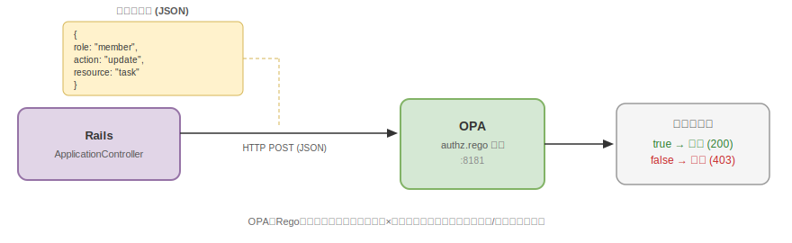

> 🇺🇸 [English version here](opa.md)

# Open Policy Agent(OPA)認可

OPAとは何か、認可においてどのように役立つのか、本プロジェクトでロールベースのアクセス制御をどう実現しているかについて記載する。


## Open Policy Agentとは

Open Policy Agent(OPA)はオープンソースの汎用ポリシーエンジンである。Regoと呼ばれる宣言型言語でポリシールールを記述し、認可判定（許可/拒否）を返す。

核心的な考え方は、ポリシーをアプリケーションコードから分離するということである。

コントローラのあちこちに`if user.admin?`のようなチェックを散在させるのではなく、認可ルールをRegoファイル1箇所にまとめる。
シンプルなHTTP APIでOPAに問い合わせるだけで認可を実装できる。




## OPA認可のメリット

| アプローチ | メリット | デメリット |
|---|---|---|
| アプリ内チェック(コントローラの`if/else`) | シンプル、追加サービス不要 | ルールがコード全体に散在し監査が困難 |
| OPA(外部化ポリシー) | ルール一元管理、言語非依存、テスト可能 | 別サービスが必要になる |

OPAが特に有効な場面としては以下が挙げられる。
- 認可ルールの「信頼できる唯一の情報源」が必要な場合
- 全権限を1ファイルで監査・レビューしたい場合
- アプリコードとは独立してポリシーをテストしたい場合
- 複数サービスで同じ認可ロジックを共有する必要がある場合


## 基本的な仕組み

### 1. Regoとは

RegoはOPAの宣言型ポリシー言語である。ルール内の条件がすべて満たされると`true`に評価される。

以下はその例である。
```rego
allow if {
    input.user.role == "member"
    input.action in ["read", "create", "update"]
}
```

ロールが`member`で、アクションが`read`, `create`, `update`のいずれかであれば許可する、という認可ルールとなる。

### 2. Input

OPAはリクエストごとに`input`というJSONオブジェクトを受け取る。
このJSONにユーザーのロールや要求アクション、対象リソースなどを含めてアプリケーションから渡す。

### 3. Decision

OPAは全ルールに対してinputを評価し、レスポンスとしてJSONオブジェクトを返す。

```json
{ "result": true }   // 許可
{ "result": false }  // 拒否
```

### 4. デフォルト拒否

ポリシーは`default allow = false`で定義する。ルールが明示的に許可しない限りすべて拒否される。
セキュアバイデフォルトのアプローチである。


## セキュリティモデルにおけるOPAの位置づけ

本プロジェクトは多層セキュリティアーキテクチャを採用している。
OPAは垂直方向のアクセス制御（テナント内でユーザーが何をできるか）を担当し、RLSと`acts_as_tenant`が水平方向の分離（テナント間のデータ分離）を担当する。

```
┌──────────────────────────────────────────────────┐
│  水平方向の分離（テナント間）                     │
│  acts_as_tenant + PostgreSQL RLS                 │
├──────────────────────────────────────────────────┤
│  垂直方向のアクセス制御（テナント内）             │
│  OPA — ロールベースの権限強制                    │
└──────────────────────────────────────────────────┘
```


## 実装の詳細

### インフラ構成

OPAはRailsやPostgreSQLと同様にDockerコンテナとして実行される。
`docker-compose.yml`内でopaコンテナを定義している。

```yaml
# .devcontainer/docker-compose.yml
opa:
  image: openpolicyagent/opa:latest
  ports:
    - "8181:8181"
  command: ["run", "--server", "--addr", "0.0.0.0:8181", "/policies"]
  volumes:
    - ../opa/policy:/policies
```

Regoポリシーファイル（`opa/policy/authz.rego`）をコンテナにマウントし、OPAが起動時にロードする。REST APIで認可判定を返す仕組みである。

### Regoポリシー

本プロジェクトの認可ポリシー全体は以下の通り。

```rego
# opa/policy/authz.rego
package authz

default allow = false

# admin: 全操作にフルアクセス
allow if input.user.role == "admin"

# member: 閲覧、作成、更新
allow if {
    input.user.role == "member"
    input.action in ["read", "create", "update"]
}

# guest: 閲覧のみ
allow if {
    input.user.role == "guest"
    input.action == "read"
}
```

権限マトリクス

| ロール \ アクション | read | create | update | delete |
|---|---|---|---|---|
| admin | ○ | ○ | ○ | ○ |
| member | ○ | ○ | ○ | × |
| guest | ○ | × | × | × |

### OPAクライアント

`OpaClient`はOPAに認可リクエストを送信するサービスクラスである。

```ruby
# app/services/opa_client.rb
class OpaClient
  OPA_URL = URI(ENV.fetch("OPA_URL", "http://opa:8181/v1/data/authz/allow"))

  def self.allowed?(user:, action:, resource:)
    payload = {
      input: {
        user: { role: user.role },
        action: action,
        resource: resource
      }
    }

    response = Net::HTTP.post(OPA_URL, payload.to_json, "Content-Type" => "application/json")
    JSON.parse(response.body).dig("result") == true
  rescue StandardError => e
    Rails.logger.error("[OPA] Request failed: #{e.message}")
    false  # フェイルセーフ: エラー時は拒否
  end
end
```

設計方針としては以下の通り。
- フェイルセーフ — OPAに繋がらない場合やエラー時はアクセス拒否（`false`）とする
- 最小限のinput — ロール、アクション、リソースのみ送信する。機密データはアプリ外に出さない
- 同期処理 — シンプルさのため`Net::HTTP.post`を使用。リクエストごとに1回呼び出す

### コントローラ統合

`ApplicationController`の`before_action`で全リクエストに対してOPAを呼び出し、認可チェックを行う。

```ruby
# app/controllers/application_controller.rb
before_action :authorize_with_opa

def authorize_with_opa
  return unless user_signed_in?

  opa_action = opa_action_for(action_name)
  resource = controller_name.singularize

  unless OpaClient.allowed?(user: current_user, action: opa_action, resource: resource)
    head :forbidden
  end
end
```

RailsアクションとOPAアクションの対応

| Railsアクション | OPAアクション |
|---|---|
| `index`, `show` | `read` |
| `new`, `create` | `create` |
| `edit`, `update` | `update` |
| `destroy` | `delete` |

OPAが`false`を返した場合、コントローラは即座にHTTP 403 Forbiddenを返し、以降の処理は行わない。

### リクエストフロー

```
1. ユーザーがリクエストを送信(例: PATCH /projects/1/tasks/2)
2. ApplicationControllerがサブドメインからテナントを解決
3. Deviseがユーザーを認証
4. authorize_with_opaが呼び出される
   a. "update"アクション → OPAアクション"update"にマッピング
   b. "tasks"コントローラ → リソース"task"にマッピング
   c. OPAに送信
      { "input": { "user": { "role": "member" }, "action": "update", "resource": "task" } }
   d. OPAがauthz.regoを評価 → { "result": true }を返す
5. コントローラがアクションを続行
```

`guest`が`update`を試みた場合、OPAは`false`を返し、コントローラは403を返す。


## ロール

ロールは`users`テーブルの`role`カラムに保存され、ユーザー作成時に割り当てられる。

| ロール | 想定用途 | 権限 |
|---|---|---|
| `admin` | テナント管理者 | 全操作 |
| `member` | 一般チームメンバー | 閲覧、作成、更新 |
| `guest` | 外部協力者 | 閲覧のみ |

Auth0コールバックで作成される新規ユーザーにはデフォルトで`guest`ロールが割り当てられる。シード管理者は`admin`ロールを保持し、変更不可（`seed_admin: true`）である。


## ポリシーの追加・変更

認可ルールを変更するには`opa/policy/authz.rego`を編集する。ボリュームマウントされているため、OPAを再起動すれば変更が反映される。

例 — プロジェクトのみ閲覧可能な`viewer`ロールを追加する場合

```rego
allow if {
    input.user.role == "viewer"
    input.action == "read"
    input.resource == "project"
}
```

アプリケーションコードの変更は不要である。これが認可を外出しにする大きなメリットとなる。


## まとめ

| 概念 | 本プロジェクトでの実装 |
|---|---|
| ポリシーエンジン | ポート8181でDockerコンテナとして実行されるOPA |
| ポリシー言語 | Rego(`opa/policy/authz.rego`) |
| APIエンドポイント | `http://opa:8181/v1/data/authz/allow` |
| クライアント | `OpaClient`(`app/services/opa_client.rb`) |
| コントローラフック | `ApplicationController`の`before_action :authorize_with_opa` |
| 障害時の動作 | フェイルセーフ — エラー時は拒否 |
| ロール | `admin`, `member`, `guest`(`users.role`に保存) |
| 関心事の分離 | OPA = 垂直（ロールベース）、RLS = 水平（テナントベース） |
