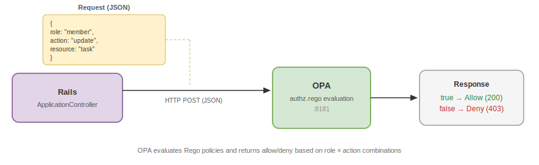

> 🇯🇵 [日本語版はこちら](opa.ja.md)

# Open Policy Agent (OPA) Authorization

This document explains what Open Policy Agent is, why it is useful for authorization, and how this project uses it to enforce role-based access control.


## What Is Open Policy Agent?

Open Policy Agent (OPA) is an open-source, general-purpose **policy engine**. It evaluates policy rules written in a declarative language called **Rego** and returns authorization decisions (allow / deny).

The key idea: **decouple policy from application code**.

Instead of scattering `if user.admin?` checks throughout your controllers, you define all authorization rules in one place (Rego files) and ask OPA "Is this action allowed?" via a simple HTTP API.




## Why Use OPA Instead of In-App Authorization?

| Approach | Pros | Cons |
|---|---|---|
| In-app checks (e.g. `if/else` in controllers) | Simple, no extra service | Rules scattered across codebase, hard to audit |
| OPA (externalized policy) | Centralized rules, language-agnostic, testable | Requires a separate service |

OPA is especially valuable when:
- You want a **single source of truth** for authorization rules
- You need to **audit or review** all permissions in one file
- You want to **test policies independently** from application code
- Multiple services need to share the same authorization logic


## Key Concepts

### 1. Rego — The Policy Language

Rego is OPA's declarative policy language. A Rego rule evaluates to `true` when all its conditions are satisfied:

```rego
allow if {
    input.user.role == "member"
    input.action in ["read", "create", "update"]
}
```

This reads as: "Allow if the user's role is `member` AND the action is one of `read`, `create`, or `update`."

### 2. Input

OPA receives a JSON object called `input` with each request. The application decides what to include — typically the user's role, the requested action, and the target resource.

### 3. Decision

OPA evaluates the input against all rules and returns a JSON response:

```json
{ "result": true }   // allowed
{ "result": false }  // denied
```

### 4. Default Deny

A well-written policy starts with `default allow = false`. This means **everything is denied unless a rule explicitly permits it** — a secure-by-default approach.


## How OPA Fits Into This Project's Security Model

This project uses a layered security architecture. OPA handles **vertical access control** (what a user can do within their tenant), while RLS and `acts_as_tenant` handle **horizontal isolation** (separating data between tenants):

```
┌──────────────────────────────────────────────────┐
│  Horizontal isolation (between tenants)          │
│  acts_as_tenant + PostgreSQL RLS                 │
├──────────────────────────────────────────────────┤
│  Vertical access control (within a tenant)       │
│  OPA — role-based permission enforcement         │
└──────────────────────────────────────────────────┘
```


## How This Project Implements OPA

### Infrastructure Setup

OPA runs as a Docker container alongside the Rails app and PostgreSQL, defined in `docker-compose.yml`:

```yaml
# .devcontainer/docker-compose.yml
opa:
  image: openpolicyagent/opa:latest
  ports:
    - "8181:8181"
  command: ["run", "--server", "--addr", "0.0.0.0:8181", "/policies"]
  volumes:
    - ../opa/policy:/policies
```

The Rego policy file (`opa/policy/authz.rego`) is mounted into the container. OPA loads it on startup and serves decisions via its REST API.

### The Rego Policy

The authorization policy defines per-resource permissions. Each resource (tenant, project, task, user) has its own set of rules:

```rego
# opa/policy/authz.rego
package authz

default allow = false

import rego.v1

# --- tenant ---
allow if { input.resource == "tenant"; input.action == "read" }
allow if { input.resource == "tenant"; input.action == "update"; input.user.role == "admin" }

# --- project ---
allow if { input.resource == "project"; input.action == "read" }
allow if { input.resource == "project"; input.action in ["create", "update"]; input.user.role in ["admin", "member"] }
allow if { input.resource == "project"; input.action == "delete"; input.user.role == "admin" }

# --- task ---
allow if { input.resource == "task"; input.action == "read" }
allow if { input.resource == "task"; input.action in ["create", "update"]; input.user.role in ["admin", "member"] }
allow if { input.resource == "task"; input.action == "delete"; input.user.role == "admin" }

# --- user ---
allow if { input.resource == "user"; input.action == "read" }
allow if { input.resource == "user"; input.action == "update"; input.user.role == "admin" }
```

This produces the following permission matrix:

| Resource \ Role | admin | member | guest |
|---|---|---|---|
| tenant (read) | ✅ | ✅ | ✅ |
| tenant (update) | ✅ | ❌ | ❌ |
| project (read) | ✅ | ✅ | ✅ |
| project (create/update) | ✅ | ✅ | ❌ |
| project (delete) | ✅ | ❌ | ❌ |
| task (read) | ✅ | ✅ | ✅ |
| task (create/update) | ✅ | ✅ | ❌ |
| task (delete) | ✅ | ❌ | ❌ |
| user (read) | ✅ | ✅ | ✅ |
| user (update) | ✅ | ❌ | ❌ |

### The OPA Client

`OpaClient` is a service class that sends authorization requests to OPA:

```ruby
# app/services/opa_client.rb
class OpaClient
  OPA_URL = URI(ENV.fetch("OPA_URL", "http://opa:8181/v1/data/authz/allow"))

  def self.allowed?(user:, action:, resource:)
    payload = {
      input: {
        user: { role: user.role },
        action: action,
        resource: resource
      }
    }

    response = Net::HTTP.post(OPA_URL, payload.to_json, "Content-Type" => "application/json")
    JSON.parse(response.body).dig("result") == true
  rescue StandardError => e
    Rails.logger.error("[OPA] Request failed: #{e.message}")
    false  # Fail-safe: deny on error
  end
end
```

Key design decisions:
- **Fail-safe** — If OPA is unreachable or returns an error, access is denied (`false`)
- **Minimal input** — Only the user's role, action, and resource are sent; no sensitive data leaves the app
- **Synchronous** — Uses `Net::HTTP.post` for simplicity; called once per request

### View Helper

A `can?(action, resource)` helper in `ApplicationHelper` enables permission-based UI rendering:

```ruby
# app/helpers/application_helper.rb
def can?(action, resource)
  OpaClient.allowed?(user: current_user, action: action, resource: resource)
end
```

Views use this to conditionally show CRUD controls (e.g. "New", "Edit", "Delete" buttons) based on the current user's role.

### Controller Integration

`ApplicationController` calls OPA on every request via a `before_action`:

```ruby
# app/controllers/application_controller.rb
before_action :authorize_with_opa

def authorize_with_opa
  return unless user_signed_in?

  opa_action = opa_action_for(action_name)
  resource = controller_name.singularize

  unless OpaClient.allowed?(user: current_user, action: opa_action, resource: resource)
    head :forbidden
  end
end
```

Rails controller actions are mapped to OPA actions:

| Rails Action | OPA Action |
|---|---|
| `index`, `show` | `read` |
| `new`, `create` | `create` |
| `edit`, `update` | `update` |
| `destroy` | `delete` |

If OPA returns `false`, the controller responds with **HTTP 403 Forbidden** immediately — no further processing occurs.

### Request Flow

```
1. User sends request (e.g. PATCH /projects/1/tasks/2)
2. ApplicationController resolves tenant from subdomain
3. Devise authenticates the user
4. authorize_with_opa is called:
   a. Maps "update" action → OPA action "update"
   b. Maps "tasks" controller → resource "task"
   c. Sends to OPA:
      { "input": { "user": { "role": "member" }, "action": "update", "resource": "task" } }
   d. OPA evaluates authz.rego → returns { "result": true }
5. Controller proceeds with the action
```

If the user were a `guest` trying to `update`, OPA would return `false` and the controller would respond with 403.


## Roles

Roles are stored in the `role` column of the `users` table and assigned at user creation:

| Role | Intended Use | Permissions |
|---|---|---|
| `admin` | Tenant administrator | All operations |
| `member` | Regular team member | Read, create, update |
| `guest` | External collaborator | Read only |

New users created via Auth0 callback are assigned the `guest` role by default. Seed admin users retain the `admin` role and cannot be changed (`seed_admin: true`).


## Adding or Modifying Policies

To change authorization rules, edit `opa/policy/authz.rego`. Since the file is volume-mounted, OPA picks up changes on restart.

Example — adding a `viewer` role that can only read projects:

```rego
allow if {
    input.user.role == "viewer"
    input.action == "read"
    input.resource == "project"
}
```

No application code changes are needed — this is the core benefit of externalized policy.


## Summary

| Concept | This Project's Implementation |
|---|---|
| Policy engine | OPA running as a Docker container on port 8181 |
| Policy language | Rego (`opa/policy/authz.rego`) |
| API endpoint | `http://opa:8181/v1/data/authz/allow` |
| Client | `OpaClient` (`app/services/opa_client.rb`) |
| Controller hook | `before_action :authorize_with_opa` in `ApplicationController` |
| Failure behavior | Fail-safe — deny on error |
| Roles | `admin`, `member`, `guest` (stored in `users.role`) |
| Separation of concerns | OPA = vertical (role-based), RLS = horizontal (tenant-based) |
