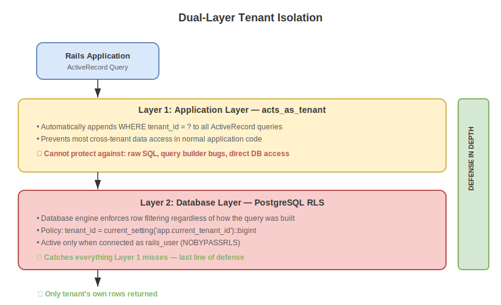
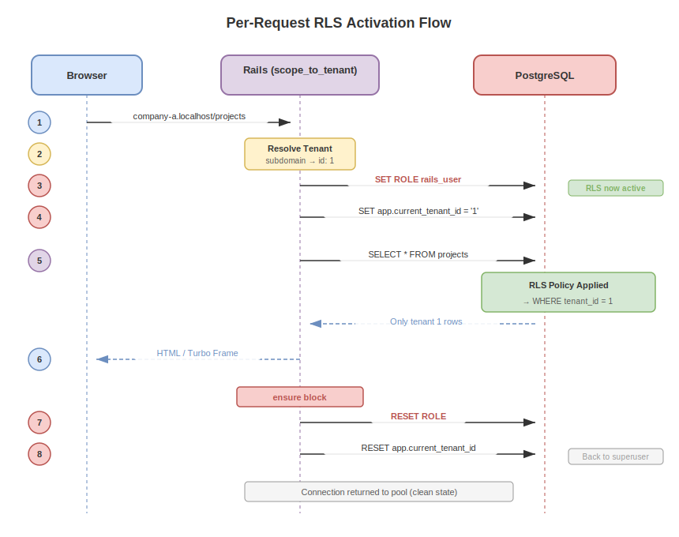

> 🇯🇵 [日本語版はこちら](rls.ja.md)

# PostgreSQL Row Level Security (RLS)

This document explains what PostgreSQL Row Level Security is, why it matters for multi-tenant applications, and how this project implements it.

---

## What Is Row Level Security?

Row Level Security (RLS) is a PostgreSQL feature that controls **which rows a database user can access** within a table.

Without RLS, access control works at the **table level** — you can grant or revoke permission to an entire table, but every permitted user sees all rows. With RLS, the database itself enforces **row-level filtering**, so a user only sees the rows that match a defined policy.

Think of it this way:

| Without RLS | With RLS |
|---|---|
| "You can read the `tasks` table" | "You can read only **your tenant's** rows in the `tasks` table" |
| Filtering depends on application code | Filtering is enforced by the database engine |

---

## Why RLS Matters for Multi-Tenant Applications

In a multi-tenant application, multiple organizations (tenants) share the same database tables. A common approach is to add a `tenant_id` column to every table and filter queries with `WHERE tenant_id = ?`.

The problem: this filtering relies entirely on the application layer. If a developer forgets a `WHERE` clause, writes a raw SQL query without scoping, or introduces a bug in a query builder, **data from other tenants can leak**.

RLS solves this by adding a **database-level safety net**:

```
Application bug → sends unscoped query → PostgreSQL RLS blocks unauthorized rows
```

Even if the application makes a mistake, the database will never return rows that violate the policy.

---

## Key Concepts

### 1. Enabling RLS on a Table

RLS is off by default. You must explicitly enable it per table:

```sql
ALTER TABLE tasks ENABLE ROW LEVEL SECURITY;
```

Once enabled, **all rows are hidden by default** for non-superuser roles — until you create a policy that grants access.

### 2. Policies

A policy defines which rows a user can see or modify. For example:

```sql
CREATE POLICY tasks_tenant_isolation ON tasks
  FOR ALL
  USING (tenant_id = current_setting('app.current_tenant_id')::bigint);
```

This policy says: "For all operations (SELECT, INSERT, UPDATE, DELETE), only allow access to rows where `tenant_id` matches the session variable `app.current_tenant_id`."

### 3. Session Variables

PostgreSQL allows you to set custom session-level variables with `SET` and read them with `current_setting()`. This project uses `app.current_tenant_id` to pass the current tenant's ID from the application to the database session, so the RLS policy can reference it.

### 4. Database Roles and BYPASSRLS

PostgreSQL superusers and roles with the `BYPASSRLS` attribute **skip all RLS policies**. This is by design — it allows administrative operations (like migrations) to work without restriction.

For RLS to be effective, the application must use a role with `NOBYPASSRLS` during normal request processing.

---

## How This Project Implements RLS

### Architecture Overview

This project uses a **dual-layer tenant isolation** strategy:



Layer 1 (`acts_as_tenant`) handles the common case by automatically appending `WHERE tenant_id = ?` to ActiveRecord queries. Layer 2 (PostgreSQL RLS) acts as the **last line of defense**, enforcing row filtering at the database engine level — even if Layer 1 is bypassed by raw SQL or query builder bugs.

### Step-by-Step Implementation

#### Step 1: Create Tables with `tenant_id`

Every tenant-scoped table includes a `tenant_id` foreign key:

```ruby
# db/migrate/*_create_projects.rb
create_table :projects do |t|
  t.references :tenant, null: false, foreign_key: true
  t.string :name, null: false
  t.timestamps
end
```

The same pattern applies to `users` and `tasks`.

#### Step 2: Create an RLS-Restricted Database Role

A dedicated role `rails_user` is created with `NOSUPERUSER` and `NOBYPASSRLS`, meaning it **cannot bypass RLS policies**:

```ruby
# db/migrate/*_create_rls_role.rb
execute <<~SQL
  CREATE ROLE rails_user WITH LOGIN PASSWORD '...' NOSUPERUSER NOBYPASSRLS;
SQL
```

This role is granted standard CRUD permissions on all tables and sequences:

```ruby
execute "GRANT SELECT, INSERT, UPDATE, DELETE ON ALL TABLES IN SCHEMA public TO rails_user;"
execute "GRANT USAGE, SELECT ON ALL SEQUENCES IN SCHEMA public TO rails_user;"
```

#### Step 3: Enable RLS and Create Policies

RLS is enabled on all tenant-scoped tables, and a policy is created for each:

```ruby
# db/migrate/*_enable_rls_policies.rb
%w[users projects tasks].each do |table|
  execute "ALTER TABLE #{table} ENABLE ROW LEVEL SECURITY;"
  execute <<~SQL
    CREATE POLICY #{table}_tenant_isolation ON #{table}
      FOR ALL
      USING (tenant_id = current_setting('app.current_tenant_id')::bigint);
  SQL
end
```

The `tenants` table uses `id` instead of `tenant_id`:

```sql
CREATE POLICY tenants_isolation ON tenants
  FOR ALL
  USING (id = current_setting('app.current_tenant_id')::bigint);
```

Tables excluded from RLS: `schema_migrations` and `ar_internal_metadata` (required for Rails migrations).

#### Step 4: Switch Roles Per Request

The application connects to PostgreSQL as `postgres` (superuser) by default. On each web request, an `around_action` in `ApplicationController` switches to the restricted role:

```ruby
# app/controllers/application_controller.rb
def scope_to_tenant
  tenant = Tenant.find_by!(subdomain: request.subdomain)
  set_current_tenant(tenant)

  conn = ActiveRecord::Base.connection
  conn.execute("SET ROLE rails_user")                          # Switch to restricted role
  conn.execute("SET app.current_tenant_id = '#{tenant.id}'")  # Set tenant context

  yield
ensure
  conn = ActiveRecord::Base.connection
  conn.execute("RESET ROLE")                  # Restore superuser
  conn.execute("RESET app.current_tenant_id") # Clear tenant context
end
```

The `ensure` block guarantees that the connection is always restored to the superuser role, even if an error occurs during the request.

### Why Two Database Users?

| User | Purpose | RLS Behavior |
|---|---|---|
| `postgres` (superuser) | Migrations, schema changes, DB connection default | Bypasses RLS |
| `rails_user` | Application request processing | Subject to RLS |

Using a single connection pool (as `postgres`) with dynamic `SET ROLE` keeps the setup simple while ensuring:
- Migrations run with full privileges
- Application queries are always filtered by RLS

### What Happens at Each Stage

The following sequence diagram shows the full lifecycle of a single request, from role switching through query execution to connection cleanup:



### Defense in Depth: What Each Layer Catches

| Scenario | acts_as_tenant only | With RLS |
|---|---|---|
| Normal ActiveRecord queries | ✅ Safe | ✅ Safe |
| Raw SQL without tenant scope | ❌ Leaks data | ✅ Blocked by DB |
| Bug in query builder / scope | ❌ Leaks data | ✅ Blocked by DB |
| Direct DB console access (as `rails_user`) | ❌ No protection | ✅ Blocked by DB |

---

## Summary

| Concept | This Project's Implementation |
|---|---|
| RLS-restricted role | `rails_user` with `NOBYPASSRLS` |
| Session variable for tenant | `app.current_tenant_id` |
| Policy condition | `tenant_id = current_setting('app.current_tenant_id')::bigint` |
| Role switching | `SET ROLE` / `RESET ROLE` in `around_action` |
| Migration safety | Runs as `postgres` (superuser), bypasses RLS |
| Tables with RLS | `tenants`, `users`, `projects`, `tasks` |
| Tables without RLS | `schema_migrations`, `ar_internal_metadata` |
